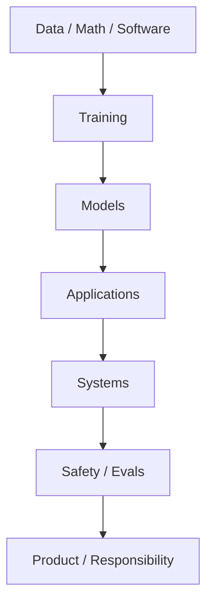

# AI Technology MOC

> 这是知识参考地图，不是优先级控制器。优先级来自 Job Sample → Role → Skill Demand；技术热点只提供辅助信号。

## Knowledge taxonomy

- Foundations：[[AI-ML-DL-and-Foundation-Models]]、[[Math-Data-and-Software-Foundations]]；
- Models：[[Transformer-and-Foundation-Models]]、[[Pretraining-Posttraining-and-Fine-tuning]]；
- Applications：[[RAG-and-Knowledge-Systems]]、[[AI-Agents-and-Tool-Use]]、[[Agent-Memory-and-Knowledge-Operations]]、[[AI-Product-Engineering]]；
- Systems：[[AI-Infrastructure-and-MLOps]]、[[Inference-Optimization]]、[[Data-Engineering-and-Governance]]；
- Safety：[[Evals-and-Observability]]、[[AI-Safety-Security-and-Governance]]。

岗位知识的学习顺序见 [[Prerequisite-Foundation-Map]]；它把基础能力与 Role–Skill 路径连接起来，不把工具热词当作课程优先级。

## 如何使用

先在 [[Career-MOC]] 选择目标 Role，再用 [[Skill-Index]] 确认要学的对象；遇到不熟名词放入 [[Terms-Inbox]]，技术变化查看 [[Technology-Radar-2026-08]]。外部教程和下载资料从 [[JasonAI-Source-Index]] 进入，先读来源边界，再把经过实践和验证的内容提升到 Knowledge。

## 图形入口

- [AI System Canvas](Maps/AI-System.canvas)
- [Career Skill Canvas](Maps/Career-Skill.canvas)
