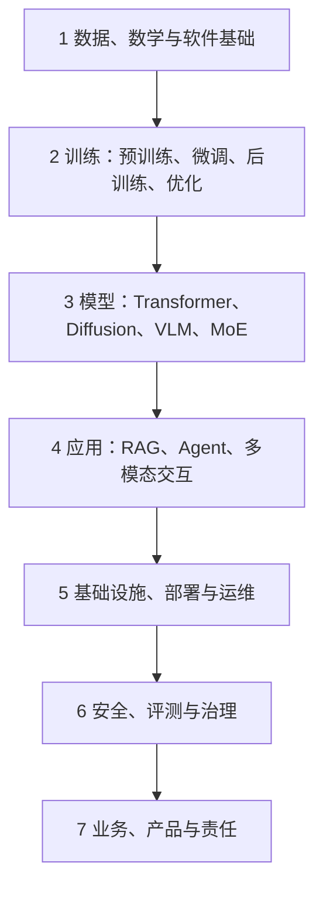

# AI Technology MOC

> 这是系统地图，不是必须逐项完成的课程目录。学习顺序看 [[Learning-Path]]。

## 七层心智模型

现实项目会跨层反复：产品约束决定评测，评测暴露数据问题，部署成本又会反向改变模型选择。

## 1. 数据、数学与软件基础

- [[Math-Data-and-Software-Foundations]]
- 数据采集、清洗、标注、切分、版本与质量
- Python、SQL、Git、Linux、测试、API、基础系统设计
- 线性代数、概率统计、优化与实验设计

## 2. 学习与训练

- [[Training-Evaluation-and-Generalization]]
- 监督学习、自监督学习、迁移学习
- 预训练、SFT、PEFT、RLHF/RLAIF、DPO/GRPO
- loss、optimizer、batch、checkpoint、overfitting、data leakage

## 3. 模型与能力

- [[Transformer-and-Foundation-Models]]
- [[Pretraining-Posttraining-and-Fine-tuning]]
- [[Multimodal-Generative-and-Embodied-AI]]
- Transformer、MoE、Diffusion、VLM、语音、世界模型、VLA

## 4. 应用系统

- [[RAG-and-Knowledge-Systems]]
- [[AI-Agents-and-Tool-Use]]
- [[AI-Product-Engineering]]
- prompt/context engineering、structured output、tool use、workflow、memory、human-in-the-loop

## 5. 系统与部署

- [[AI-Infrastructure-and-MLOps]]
- [[Inference-Optimization]]
- [[Data-Engineering-and-Governance]]
- GPU/NPU、分布式训练、模型服务、缓存、队列、可观测性、成本与可靠性

## 6. 评测、安全与治理

- [[Evals-and-Observability]]
- [[AI-Safety-Security-and-Governance]]
- offline eval、online experiment、red teaming、prompt injection、privacy、policy、audit

## 7. 产品与业务

- 用户任务、成功指标、工作流重构、ROI、风险边界、组织采用
- 岗位映射见 [[Role-Map]] 与 [[Job-Skill-Matrix]]

## 一个名词应该放在哪里

| 名词            | 首要归属     | 不要误解为           |
| ------------- | -------- | --------------- |
| Transformer   | 模型结构     | 某一个聊天产品         |
| RAG           | 应用与知识系统  | 自动保证事实正确        |
| Agent         | 应用控制循环   | 一定自主、一定多 Agent  |
| LangGraph     | 当前工具     | Agent 原理本身      |
| CUDA/NCCL     | 系统与硬件软件栈 | 模型算法            |
| Evals         | 能力与质量证据  | 单一 benchmark 分数 |
| AI governance | 组织与制度控制  | 只由法务负责          |

## 图形入口

- [[00-Home/Maps/AI-System.canvas]]
- [[00-Home/Maps/Career-Skill.canvas]]
