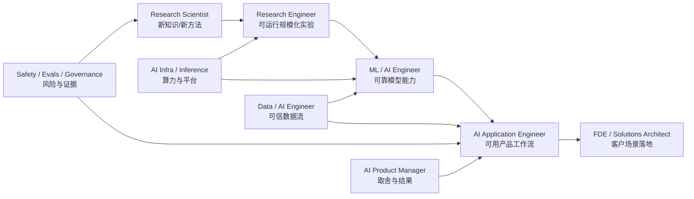

# Career MOC

> 不从岗位名称猜工作内容；从“主要交付物”判断岗位。

## 岗位价值链

## 岗位页

- [[Research-Scientist]]
- [[Research-Engineer]]
- [[ML-and-AI-Engineer]]
- [[AI-Application-Engineer]]
- [[AI-Infrastructure-and-Inference-Engineer]]
- [[Data-and-AI-Engineer]]
- [[AI-Product-Manager]]
- [[AI-Solutions-Architect-and-FDE]]
- [[AI-Safety-Evals-and-Governance]]

## 选择方法

优先问：

1. 你更想发现新方法，还是把已知方法做成可靠系统？
2. 你喜欢模型行为、用户工作流、底层性能，还是组织风险？
3. 你的最佳证据是论文、代码仓库、线上指标、客户交付，还是治理框架？
4. 你愿意承担哪种失败：实验不成立、系统不稳定、产品没人用、成本失控或风险漏检？

然后用 [[Job-Skill-Matrix]] 对照，不要被相似职位名迷惑。

## 市场证据

- 当前结论与限制：[[2026-08-AI-Job-Market-Snapshot]]
- 来源清单：[[Source-Index]]
- 角色和技能矩阵是对样本的综合解释，不是招聘承诺。
