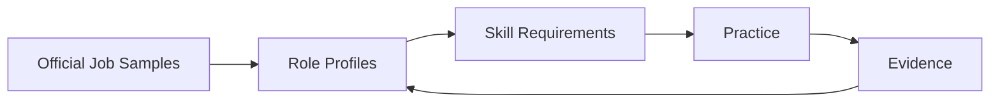

# Career MOC

> 主图从可核验 Job Sample 出发，经过 Role Profile 和 Skill Requirements，最后落到 Practice 与 Evidence。

## 入口

- [[Job-Sample-Index]]：按公司、区域、职位和时间看样本；
- [[Role-Map]]：按主要交付物和责任簇看岗位；
- [[Role-Skill-Matrix]]：编辑性比较，原始证据回到 Job Samples；
- [[Role-Skill-Paths]]：按 Role 串起 Core Skills、Prerequisites 和 Specialized Skills；
- [[Skill-Index]]：按技能、前置关系和 Practice 学习；
- [[Role-Skill-Assessment]]：把目标 Role 与当前证据对齐。

## 角色选择

问“我想交付什么、承担哪类失败、需要哪种证据”，不要只按职位名称分类。样本存在公司、区域、职级和团队偏差，见 [[2026-08-AI-Job-Market-Snapshot]]。
