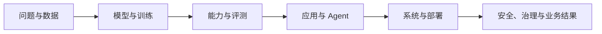

# Start Here

> 这是本 Vault 的唯一默认入口。不要从 Global Graph 或一长串术语开始。

## 这个仓库如何帮你

AI 的名词看起来零散，是因为它们其实来自不同层：有些描述学习原理，有些是模型结构，有些是应用模式，有些只是某个工具名，还有一些来自岗位分工。先分层，名词才不会互相覆盖。

## 三种使用方式

### 1. 我想系统理解 AI

打开 [[AI-Technology-MOC]]，先建立全景，再按 [[Learning-Path]] 完成六个阶段。每个阶段都有一个可验证产出，不要求死记全部名词。

### 2. 我想知道岗位需要什么

打开 [[Career-MOC]]，再看 [[Job-Skill-Matrix]]。先选“你想交付什么”，再决定技能深度：研究新算法、训练模型、做 AI 产品、优化基础设施、把方案落到客户现场，路径并不相同。

### 3. 我刚遇到一个陌生名词

把它写进 [[Terms-Inbox]]，只回答四件事：

1. 它属于哪一层？
2. 它解决什么问题？
3. 它依赖哪些已有概念？
4. 现在需要理解、需要实践，还是只需知道名字？

如果你已有开发、研究或数据工作经验，先做 [[Fast-Track-Assessment]]，用真实产出跳过已掌握的部分。

## 先看这五页

1. [[AI-ML-DL-and-Foundation-Models]]：先分清最常混用的上位概念；
2. [[AI-Technology-MOC]]：看系统全景；
3. [[Role-Map]]：看岗位是如何沿价值链分工的；
4. [[Job-Skill-Matrix]]：看共同底座与差异化能力；
5. [[Technology-Radar-2026-08]]：区分稳定基础、当前重点与前沿观察项。

## 今天只做一件事

从最近听到的 3 个 AI 名词中任选一个，加入 [[Terms-Inbox]]，然后给它标注层级。不要马上开十个网页。

如果更想从职业目标开始，则在 [[Role-Map]] 中选一个“候选岗位”，不用立刻确定终身方向。

## 重要提醒

- “Prompt Engineer” 更适合作为一组能力，而不是默认独立职业终点；
- 会调用模型 API 不等于会构建可靠 AI 系统；
- 能训练模型不等于知道模型在真实场景为何失败；
- 当前岗位快照是样本，不是市场普查，详见 [[2026-08-AI-Job-Market-Snapshot]]。
