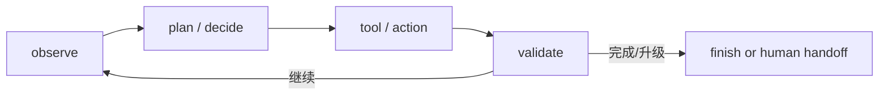

# AI Agents and Tool Use

## 最小定义

Agent 是一个围绕目标反复执行“观察—决定—行动—检查”的系统。模型可以参与决策，但完整 Agent 还需要状态、工具、权限、终止条件、错误处理和评测。

## Workflow 与 Agent

- **Workflow**：路径主要由代码或人预先定义；
- **Agent**：模型在运行时决定部分步骤或工具；
- 两者可以混合。可预测任务通常先用 workflow，再只把不确定决策交给模型。

## 必备控制面

- 工具 schema 与输入验证；
- 最小权限、secret 隔离、sandbox；
- 状态与可恢复 checkpoint；
- retry、timeout、幂等、预算与速率限制；
- 人工审批和高风险动作确认；
- trace、任务级 eval 与终止条件。

## 热门名词的位置

| 名词 | 位置 |
| --- | --- |
| Function calling / tool use | 让模型选择结构化动作 |
| Context engineering | 构建模型当前可见的信息与约束 |
| Memory | 跨步骤或跨会话保存状态/知识 |
| MCP | 连接模型应用与外部工具/上下文的协议层 |
| Multi-agent | 多个角色/控制循环分工，不天然更可靠 |
| Computer use | 通过 UI 感知与操作软件，攻击面更大 |

## 当前岗位信号如何解读

AI Index 2026 显示 2025 年美国岗位中 Agentic AI、AI agents、Agentic systems 和 LangGraph 等词快速增长。可取的结论是企业开始招聘“协调并运行任务系统”的能力；不可取的结论是某个框架会成为永久标准。见 [[2026-08-AI-Job-Market-Snapshot]]。

## 最小实践

实现一个只使用 2–3 个工具的任务系统，并准备：20 个任务、5 个对抗输入、最大步骤数、预算、错误注入、人工审批点与任务成功率。先证明单 Agent/Workflow 可控，再考虑多 Agent。

## JasonAI 来源中的实操补充

[[Agent-Hooks-Guide]] 提供了一个有用的控制面区分：Prompt/`AGENTS.md` 负责告诉 Agent 要求，Skill 负责可复用的方法，MCP/Tool 提供外部能力，Hook 在生命周期节点自动检查，而 Permission/Sandbox 才是不可越过的权限边界。Hook 触发比自然语言指令确定，但脚本仍可能超时或报错，不能替代沙箱。

[[Obsidian-AI-Agent-Skills-Configuration]]、[[Obsidian-CLI-AI-Agent-Automation]]、[[Obsidian-MCP-Automation]] 和 [[Obsidian-MCP-Beginner]] 展示了把 Agent 接入笔记库、命令行和外部应用的路径。它们适合作为工具实例来练习 schema、权限、幂等、日志和人工审批，不应直接证明某个产品是岗位必需技能。

[[n8n-Obsidian-RSS-Automation]] 与 [[Claude-Code-n8n-Workflow]] 可用来演练“触发 → 处理 → 写入 → 验收”的 Workflow；在自动写入知识库前，应增加去重、来源 URL、失败重试上限和人工抽查。

## 一个可复用的 Agent 评审问题集

- 目标能否拆成可观察的输入、工具调用和验收结果？
- 每个工具的 schema、权限、超时、预算、幂等键和错误返回是否明确？
- 哪些动作必须由 Hook/沙箱强制拦截，哪些只需要提示？
- 如果上下文、记忆或检索结果错误，系统如何拒答、回滚和交给人？
- 是否有一组固定任务、对抗输入和 trace，能区分模型问题与编排问题？

## 一手资料

- Anthropic, [Building effective agents](https://www.anthropic.com/research/building-effective-agents)
- [Model Context Protocol documentation](https://modelcontextprotocol.io/)
