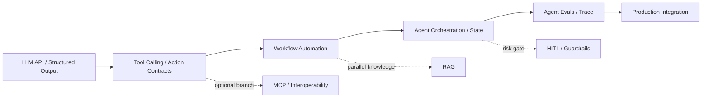

# AI Agents and Tool Use

## 定位：伞页，不是单一课程

Agent 是围绕目标执行“观察—决定—行动—检查”的系统。模型只是其中一个决策组件；完整系统还需要状态、工具、权限、终止条件、错误处理、评测和业务结果。本页负责导航，正式学习对象拆到可验证 Skills。

## 分解地图

| 分支 | 正式 Skill / 知识页 | 学习边界 |
| --- | --- | --- |
| LLM I/O | [[LLM-API-and-Structured-Outputs]] | schema、校验、版本、成本/延迟 |
| Actions | [[Tool-Calling-and-Action-Contracts]] | 工具、权限、幂等、错误与副作用 |
| Orchestration | [[Agent-Orchestration-and-State]] | 状态机、事件、checkpoint、恢复 |
| Workflow | [[Workflow-Automation-and-Business-Process-Design]] | discovery、触发器、审批、业务结果 |
| Interoperability | [[MCP-and-Agent-Interoperability]] | MCP client/server、发现、transport、授权 |
| Memory | [[Agent-Memory-and-Knowledge-Operations]] | 仅按使用场景补齐，当前仍是概念页 |
| RAG | [[RAG]] / [[RAG-and-Knowledge-Systems]] | 与 Agent 并行，是否需要取决于任务 |
| Safety | [[Human-in-the-Loop-and-Agent-Guardrails]] | 风险分级、审批、sandbox、kill switch |
| Evals | [[Agent-Evals-and-Trace-Debugging]] / [[Evals-and-Observability]] | 任务、轨迹、评分、回归、诊断 |
| Computer use | [[Anthropic-Research-Engineer-Computer-Use-San-Francisco-2026-08]] | 专项能力，不是默认路径 |
| Multi-agent / A2A | [[MCP-and-Agent-Interoperability]] | 高级互操作；先证明单 Agent/workflow |

## Workflow 与 Agent

- **Workflow**：路径主要由代码或人预先定义，适合可预测、可审计任务；
- **Agent**：模型在运行时决定部分步骤或工具，适合存在不确定性的局部环节；
- **混合**：先用 deterministic workflow，再把不确定决策放进有预算、终止和审批的边界。

## 必备控制面

工具 schema 与输入验证；最小权限、secret 隔离和 sandbox；状态与可恢复 checkpoint；retry、timeout、幂等、预算与速率限制；人工审批；trace、任务级 eval 和终止条件。

## 证据与学习原则

岗位样本决定技能优先级，官方规范决定协议边界，JasonAI 教程只提供练习素材。产品名、框架名和“多智能体”不能自动升级为 Skill；RAG 不作为所有 Agent 的前置；热门不等于必须学习。

## JasonAI 实操入口

- [[Agent-Hooks-Guide]] → Tool Calling / Guardrails / Workflow；
- [[Agent-Memory-Basic-Memory-Guide]] → Memory 概念；
- [[Obsidian-MCP-Beginner]]、[[Obsidian-MCP-Automation]]、[[Notion-MCP-Beginner]] → MCP / Integration；
- [[Claude-Code-n8n-Workflow]]、[[n8n-Obsidian-RSS-Automation]]、[[n8n-Notion-AI-Production]] → Workflow；
- [[Obsidian-CLI-AI-Agent-Automation]] → Agent Workflow；
- [[Obsidian-AI-Integration-Methods]] → Integration；
- [[Obsidian-AI-Agent-Skills-Configuration]]、[[Claude-Skill-Quick-Start]] → Agent Skills 知识（不自动成为正式 Skill）。

## 一手资料

- [Anthropic — Building effective agents](https://www.anthropic.com/engineering/building-effective-agents)
- [MCP Architecture](https://modelcontextprotocol.io/docs/2026-07-28/learn/architecture)
- [A2A Specification](https://a2a-protocol.org/v0.3.0/specification/)
