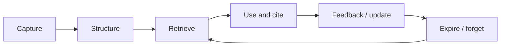

# Agent Memory and Knowledge Operations

## 最小定义

Agent Memory 是让智能体在跨会话、跨任务或跨 Agent 的场景中保存、检索、更新和淘汰有价值信息的系统能力。它不是“把聊天记录全部存起来”，而是一条可审计的知识运作链：

## 三种信息不要混为一谈

| 层 | 解决的问题 | 在本仓库中的对应物 |
| --- | --- | --- |
| 当前上下文 | 这一次任务需要看什么 | 对话、工具结果、当前文件 |
| 长期指令 | Agent 必须怎样工作 | `AGENTS.md`、模板、页面契约 |
| 长期记忆 | 未来可能复用的事实和经验 | 经过来源、日期和状态标注的笔记 |

指令是约束，记忆是可更新的知识；把二者混写会让过期事实看起来像永远有效的规则。

## 记忆写入的判断门

只保留未来能改变决策或减少重复劳动的信息：用户偏好、稳定项目事实、已验证的失败路径、带日期的决策和可复用的经验。一次性闲聊、未经核验的猜测、完整会话转储和供应商宣传语不应直接进入长期记忆。

每条记忆最好带上：来源、捕获日期、适用范围、置信度/验证状态、过期或复查日期，以及与其他概念的关系。事实变化时更新旧记录或标记冲突，不要只追加一条互相矛盾的新句子。

## 与 RAG、Knowledge Format 的边界

- **Memory** 关注“哪些过去信息值得留下、何时取回、如何改变未来行为”；
- **RAG** 关注“从外部语料召回哪些证据并放入当前上下文”；
- **Knowledge Format** 关注“知识用什么开放结构保存和交换”。

三者可以组合，但不能互相替代：Markdown + YAML 让内容可交换，不保证检索正确；向量检索能召回文本，不保证事实新鲜；记忆能改变行为，也可能放大错误，因此必须配合引用、权限和评测。

## 可执行的最小实现

1. 先用一个小型 Markdown 知识包和清晰的 `index`，不要一开始建设复杂向量数据库；
2. 为每个来源记录 `source_url`、`retrieved`、状态和复查日期；
3. 建立 20 个真实问题，记录应命中的笔记、不可回答条件、引用正确性和延迟/成本；
4. 用一次“写入 → 检索 → 更新 → 过期”的演练检查重复、冲突、权限和删除是否可控；
5. 只有当单 Agent/Workflow 的召回和更新可解释时，才考虑多 Agent 或自动反思。

## 常见失败

- **只记不取**：写入量增加，但没有检索触发条件；
- **只取不更新**：旧事实与新事实同时进入上下文；
- **把工具教程当记忆**：版本相关的安装步骤被误当成稳定概念；
- **无权限边界**：跨项目或跨用户共享了不应共享的上下文；
- **没有删除路径**：无法撤回、过期或证明某条记忆为何被采用；
- **把摘要当证据**：记忆中的二手总结替代了原始来源。

## JasonAI 来源如何接入本仓库

本次把 45 篇可下载文章存为 `90-Sources/JasonAI/` 的来源层；其中与本概念直接相关的材料包括：

- [[Agent-Memory-Basic-Memory-Guide]]：原生 Memory 与 Basic Memory 的对比、写入/检索/更新循环；
- [[Google-Open-Knowledge-Format]]：Knowledge Bundle、渐进式披露、来源追踪、时效性与生命周期；
- [[Claude-Code-Obsidian-Karpathy-LLM-Wiki]]：Inbox → 编译 → 概念页 → 注册表的知识维护工作流；
- [[Claude-Code-Obsidian-NotebookLM]] 与 [[NotebookLM-Advanced-Tips]]：以资料集、引用和提示词约束为核心的研究辅助流程；
- [[Obsidian-Copilot-RAG]]：在 Obsidian 内配置问答/RAG 时需要区分模型、嵌入、检索和答案设置。

这些文章是实操参考，不是本仓库的岗位证据或官方规范；涉及产品参数、插件兼容性和 API 的结论应回到厂商文档复核。

## Related Knowledge

- [[AI-Agents-and-Tool-Use]]
- [[RAG-and-Knowledge-Systems]]
- [[Data-Engineering-and-Governance]]
- [[AI-Technology-MOC]]
