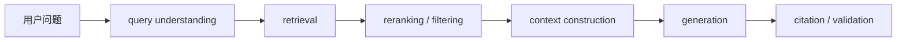

# RAG and Knowledge Systems

## RAG 是什么

Retrieval-Augmented Generation 在生成前检索外部证据，把模型参数之外的知识送入上下文。它主要解决知识可更新、可追溯和领域信息访问问题，不自动解决推理错误或来源错误。

## 关键组件

- 文档解析、chunking、metadata 与权限；
- sparse / dense / hybrid retrieval；
- embedding 与 vector database；
- reranker 与 query rewriting；
- context budget、去重与排序；
- 引用、答案拒绝、freshness 与缓存。

## 典型失败

| 层 | 失败 |
| --- | --- |
| 数据 | 文档过期、权限错误、解析丢失 |
| 检索 | 没召回、召回噪声、查询歧义 |
| 上下文 | 证据被截断、顺序偏差、互相冲突 |
| 生成 | 忽略证据、混合来源、无依据扩写 |
| 产品 | 用户无法判断可信度、无反馈闭环 |

## 评测拆分

不要只评最终答案。分别测 retrieval recall/precision、reranking、context relevance、faithfulness、answer usefulness、citation correctness、latency 和 cost。

## 何时不用 RAG

- 知识很小且规则可精确编码；
- 任务不依赖外部知识；
- 权限或来源无法可靠管理；
- 需要结构化计算，应该调用数据库/API/工具；
- 数据极少且可直接放入固定 context。

## 最小实践

用 30–50 个真实问题建立 golden set，记录每题应命中的来源、不可回答条件与失败类型，再比较“无检索 / 简单检索 / hybrid + rerank”。

## JasonAI 来源中的实操补充

[[Google-Open-Knowledge-Format]] 把 Knowledge Bundle、`index.md`、Concept、来源追踪、Freshness 和生命周期放在同一个开放结构里；这与本仓库的“来源层 → 知识层 → MOC”分层相容，但 OKF 的格式建议不等于检索质量证明。

[[Agent-Memory-Basic-Memory-Guide]] 补充了 Memory 与 RAG 的边界：Memory 保存会改变未来行为的事实/经验，RAG 在当前任务中召回外部证据。两者组合时仍需保留原始来源、更新时间、冲突处理和删除路径。

[[Obsidian-Copilot-RAG]] 可作为插件级实验材料。配置模型、Embedding、检索、上下文和答案设置时，记录版本、数据范围、权限和评测结果；不要把插件默认参数写成稳定的 RAG 结论。

## 读完来源后要留下的证据

每次把外部文章转成内部知识，至少保留：原文 URL、抓取日期、被采纳的主张、未采纳或待核验的主张、一个可复现的小测试，以及与岗位技能/作品集的连接。没有这些字段的“AI 总结”只能放在来源层，不能作为 Job Evidence。

## 一手资料

- Lewis et al., [Retrieval-Augmented Generation for Knowledge-Intensive NLP Tasks](https://arxiv.org/abs/2005.11401)
