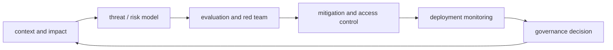

# AI Safety, Security and Governance

## 三个相交但不同的范围

| 范围 | 主要问题 |
| --- | --- |
| Safety | 系统行为是否造成伤害、误导或失控风险 |
| Security | 攻击者能否越权、注入、窃取、操纵或破坏系统 |
| Governance | 组织如何分配责任、制定规则、记录证据并持续监督 |

## 风险面

- 不可靠输出、过度依赖与错误自动化；
- prompt injection、jailbreak、tool abuse；
- 数据泄漏、模型窃取、供应链风险；
- 偏差、公平性、可访问性；
- 高风险领域中的错误建议或自主行动；
- 监控缺失、责任不清、无法审计与回滚。

## 控制闭环

## 工程控制

- 输入/输出验证与内容策略；
- 最小权限、sandbox、secret 隔离；
- 高风险工具人工审批；
- 数据分级、访问控制、日志与保留策略；
- safety eval、red team、incident response；
- 版本、变更审查、回滚和审计记录。

## 为什么这是跨职能岗位

DeepMind 的 Responsibility 团队横跨 CBRN、assurance evals、AI governance、政策、研究和工程；OpenAI 的 Safety Measurement PM 样本同时要求安全领域、数据/统计背景、跨学科理解和跨团队沟通。见 [[2026-08-AI-Job-Market-Snapshot]]。

## 最小实践

为一个可调用工具的 Agent 写 threat model：资产、攻击者、入口、权限、不可接受结果、检测信号、控制、残余风险、响应与责任人。

## 权威入口

- [NIST AI Risk Management Framework](https://www.nist.gov/itl/ai-risk-management-framework)
- [OWASP Top 10 for LLM Applications](https://genai.owasp.org/llm-top-10/)
