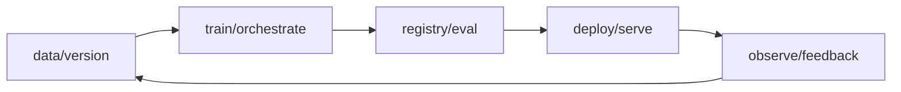

# AI Infrastructure and MLOps

## 两个相交但不同的焦点

- **MLOps**：数据、训练、评测、部署、监控和更新的生命周期；
- **AI Infrastructure**：支撑大规模训练/推理的数据中心、计算、网络、存储、调度和软件栈。

## 关键层

| 层 | 典型问题 |
| --- | --- |
| Compute | GPU/NPU 配额、利用率、故障、异构设备 |
| Network | 集合通信、带宽、拓扑、拥塞 |
| Storage/Data | 吞吐、checkpoint、缓存、lineage |
| Orchestration | 作业调度、重试、优先级、隔离 |
| Lifecycle | 实验追踪、registry、CI/CD、回滚 |
| Observability | metrics、logs、traces、capacity |

## 共同目标

- reproducibility；
- reliability；
- scalability；
- utilization；
- security；
- developer velocity；
- cost efficiency。

## 岗位为什么强调分布式系统

OpenAI 的 Research Engineer 与 Model Inference 岗位都把大规模分布式系统列为核心；DeepMind 把构建分布式计算基础设施写入 Research Engineer 职责。市场数据也把 scalability、automation、workflow management 和 AWS 列为高频/高增长技能。见 [[2026-08-AI-Job-Market-Snapshot]]。

## 最小实践

把一个训练或推理任务做成可重复管线，记录代码/数据/配置/checkpoint 版本；注入一次失败，证明任务能恢复且不会覆盖错误产物。

## 官方入口

- [MLflow documentation](https://mlflow.org/docs/latest/)
- [Kubernetes documentation](https://kubernetes.io/docs/home/)
- [PyTorch distributed documentation](https://pytorch.org/docs/stable/distributed.html)
