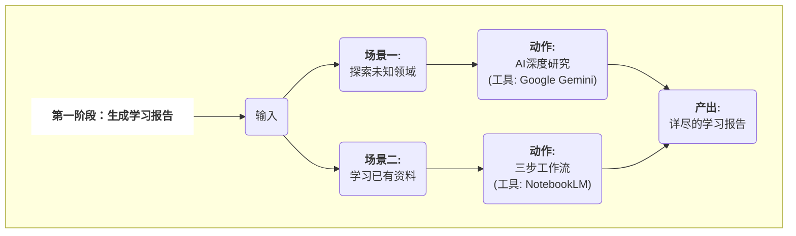
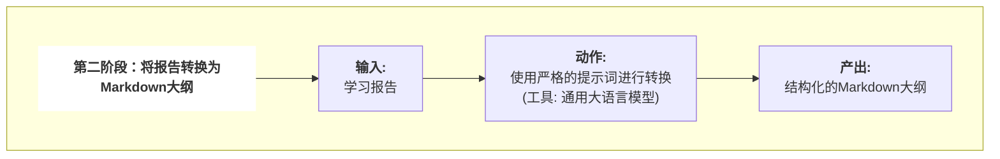
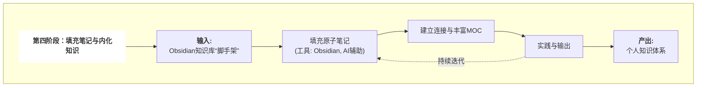

利用人工智能（AI）作为执行工具，在Obsidian中构建结构化、可扩展的个人知识库，并以此为基础进行高效、深入的学习。


**主要涉及工具：**

- **信息规划**：Google Gemini Deep Research (或其他具备Deep Research的AI工具), Google NotebookLM
- **大纲生成**：通用大语言模型 (Gemini, ChatGPT, Deepseek等)
- **框架搭建**：Cursor (或其替代品，如TRAE, Gemini CLI, Claude Code, VS Code + Cline)
- **知识承载与学习**：Obsidian

---

## **第一阶段：生成学习报告**



### **场景一：学习一个全新的领域**

当我们面对一个完全陌生的领域时，我们利用具备深度研究能力的AI模型，为我们系统性地梳理知识。

成功的关键在于向AI提出一个高质量的、复杂的指令。这个指令需要清晰地定义我们的身份背景、最终学习目标、对学习路径的阶段性要求，以及对输出格式的规定。AI在接收到这样的指令后，会启动其深度研究模式，通过自主规划、全网检索、多源分析等一系列动作，最终生成一份结构化的深度报告。

### **场景二：学习已有的私有资料**

当我们已经收集了大量学习资料（如PDF、文档）时，我们使用Google NotebookLM这类工具，让AI成为只基于我们私有资料进行回答的领域专家。

为了保证质量，我们采用一种“对话式”的三步工作流：

1. **宏观理解**：首先让AI通读所有资料，并生成一份核心摘要。我们通过追问来校准AI的宏观理解，直至与我们的预期达成一致。
2. **设计学习路径**：在达成共识的基础上，我们让AI基于摘要，设计一个逻辑清晰的学习路线图，并要求它为每个主题附上在原始资料中的来源引用。
3. **生成最终报告**：当我们对学习路径完全满意后，再让AI输出一份详尽的、包含所有讨论成果的学习报告。

---

## **第二阶段：将报告转换为Markdown大纲**



第一阶段产出的学习报告，是适合人类阅读的“文章”。为了让自动化工具能够理解，我们必须进行第二步：将其转换为机器可读的格式。

目标是将“文章式”的报告，转换成一个纯粹的、结构化的Markdown大纲。我们使用一个强大的大语言模型，通过一个极其严格的指令，让它将输入文本重构成我们预先设计好的、具有三层嵌套逻辑的格式：

- **二级标题 (H2)**：定义顶级的知识分类，将成为顶级文件夹。
- **三级标题 (H3)**：定义该分类下的具体主题，将成为主题文件夹。
- **无序列表项**：定义该主题下最基础的原子知识点，将成为原子笔记。

这个过程将一份充满细节的报告，提纯为一份毫无歧义的、用于下一步自动化操作的结构化指令清单。

---

## **第三阶段：自动化创建知识库框架**


这是整个流程中效率提升最显著的环节。我们将上一步生成的Markdown大纲，交给AI执行工具，让它在几分钟内，为我们搭建起知识库的完整框架。

为保证过程的稳定可控，我们将搭建过程分解为四个清晰的、循序渐进的步骤，通过向Cursor（或其替代品）分步发送指令来完成。

1. **创建顶级分类文件夹**：AI根据大纲的二级标题，在Obsidian库的根目录下创建对应的顶级文件夹。
2. **创建主题文件夹与MOC笔记**：AI根据三级标题，在对应的顶级文件夹内创建主题文件夹，并在其中生成一个以“主题名 MOC.md”命名的、空的索引笔记（内容地图）。
3. **创建并链接原子笔记**：AI根据列表项，在对应的主题文件夹内创建所有空的原子笔记。同时，AI会自动打开每个MOC笔记，并将该主题下所有原子笔记的链接，以Obsidian双向链接的格式写入其中。
4. **创建知识库总览笔记**：最后，AI可以在根目录下创建一个作为整个知识库中央枢纽的总览笔记，并链接到各个核心主题的MOC笔记。

通过这四步，一个纯文本大纲被全自动地转换成了一个结构严谨、层次分明、功能完备的Obsidian知识库“脚手架”。

---

## **第四阶段：填充笔记与内化知识**




### **填充原子笔记**

这是学习的基础。我们每天选择少数几个原子笔记作为目标。针对这些高度聚焦的知识点，可以再次利用AI进行高效的信息输入。但最关键的步骤是，在完成输入后，**我们必须用自己的语言，将对这个知识点的理解、思考和总结，完整地写入Obsidian的笔记中**。这个“知识重述”的过程，是知识内化的核心。

### **建立连接与丰富MOC**

当原子笔记逐渐丰富后，我们需要构建知识网络。在撰写新笔记时，主动思考并创建与已有知识的双向链接。同时，定期回到MOC笔记，撰写对该主题的总结性概述，阐述其下属原子知识点之间的内在逻辑。这会让MOC笔记从一个简单的目录，升华为对一个主题的高度浓缩的理解。

### **实践与输出**

知识的最终价值体现在应用。我们可以通过设定具体的项目来实践所学，或尝试以写作、分享等形式将知识“教”给别人。这个过程会以最高标准检验我们的学习成果，并迫使我们对知识进行更深层次的结构化重组。

通过持续地填充、连接与实践，一个由AI搭建的框架，将最终演化成一个真正属于我们自己的、内容充实、连接丰富的个人知识体系。


## 搭建知识库架构：Cursor类工具


## 核心问题
当面对一个全新的、陌生的知识领域时，如何利用AI快速、高效地搭建起整个知识库的初始结构？这包括自动创建文件夹、笔记文件、目录（MOCs），并为每个知识点撰写初步的概要，即所谓的“知识库脚手架”（Knowledge Base Scaffolding）。

## 核心理念：建筑师 vs. 室内设计师
要解决这个问题，首先需要理解不同AI工具在此场景下的角色定位。我们可以用一个生动的比喻来区分：

- **“建筑师” (Architects):** 这类工具（如Cursor, VS Code+Cline插件）具备**项目级视野和文件系统操作能力**。它们能看懂整个项目的“蓝图”（如一个Markdown大纲），并据此搭建起整个建筑的框架（创建文件夹和文件）。
- **“室内设计师” (Interior Designers):** 这类工具（如Obsidian AI插件）专注于**已存在的空间内部**。它们负责在单个房间（笔记）内进行精装修（撰写和润色内容），并打通房间之间的连接（创建双向链接）。

在“知识库脚手架”这个场景中，我们首先需要的是一位**建筑师**。

## 工具对比：谁是最佳“建筑师”？

### 场景一：知识库骨架搭建 (Scaffolding)
这个阶段的核心任务是**从无到有地创建结构**。

| 工具类别 | 核心能力 | 文件系统权限 | 【脚手架】场景表现 |
| :--- | :--- | :--- | :--- |
| **“建筑师”类工具**<br>(Cursor, Cline, TRAE, Gemini CLI) | 理解项目结构，执行多步骤任务 | **高** (读、写、创建、删除) | **非常胜任**。能自动化执行“根据大纲创建目录树和文件”的复杂指令。 |
| **“室内设计师”类工具**<br>(Obsidian AI插件,例如Copilot) | 理解笔记内容，在当前笔记中操作 | **低** (主要为读取，有限的写入) | **不胜任**。无法执行跨文件的、批量创建文件/文件夹的指令，需要大量手动干预。 |

### 场景二：日常知识管理与内容填充
当骨架搭建完毕后，工作重心转移到**内容的精细化处理和知识连接**上。

| 工具类别 | 核心能力 | 知识连接能力 | 日常使用体验 |
| :--- | :--- | :--- | :--- |
| **“建筑师”类工具** | 代码和项目结构理解 | 较弱或非核心 | 过于专业，缺少为知识管理优化的功能（如双链、标签面板）。 |
| **“室内设计师”类工具** | 文本润色、总结、问答、链接建议 | **极强** (双链、MOCs、图谱) | **完美契合**。专为非线性、网络化的知识管理而生，体验流畅。 |

## “知识库建筑师”工具深度横评
既然确定了需要“建筑师”，那么市面上有哪些优秀的选择？

| 工具 (Tool) | 类型 | 交互方式 | 【脚手架】能力 | 优势 | 劣势 |
| :--- | :--- | :--- | :--- | :--- | :--- |
| **Cursor** | 独立AI编辑器 | GUI聊天窗口 | **非常高** | 开箱即用，AI与编辑器深度融合，交互体验流畅自然。 | 闭源，对BYOK（自带Key）的政策可能摇摆，有被厂商锁定的风险。 |
| **Cline (in VS Code)** | VS Code 插件 | GUI聊天窗口 | **非常高** | **开源透明**，完全由用户控制API Key和成本，能利用VS Code庞大的插件生态。 | 需要用户自行安装和配置VS Code及插件，多一步设置。 |
| **TRAE 2.0** | 独立AI编辑器 | GUI聊天窗口 | **高** | **完全免费**使用GPT-4o/Claude 3.5等顶级模型，无需自己的Key，功能激进。 | 较新，生态不成熟，有用户对其数据隐私和遥测表示担忧。 |
| **Gemini CLI / Claude Code** | 命令行工具 | 终端命令 | **极高 (需脚本)** | **自动化潜力最强**，可集成到任何脚本中，实现复杂和可重复的搭建流程。 | **用户门槛最高**，无图形界面，需要熟悉命令行和脚本编写。 |

## 最佳实践：混合工作流 (Hybrid Workflow)
最高效的策略是结合两类工具的优势，采用分阶段的混合工作流。

### 阶段一：架构搭建 (使用“建筑师”)
1.  **规划蓝图**: 使用AI（如Gemini, ChatGPT）或自己思考，制定一份详细的学习路径，并整理成Markdown层级列表格式。
2.  **选择工具**: 启动 **Cursor** 或 **VS Code + Cline插件**。
3.  **自动建造**: 在工具中打开一个空文件夹（未来的Obsidian库），将Markdown大纲粘贴给AI，并下达明确指令：
    > “请根据这个Markdown大纲，为我创建对应的文件夹和`.md`笔记文件。一级标题作为文件夹，二级标题作为该文件夹下的笔记文件。然后，为每个创建的笔记文件撰写一段简短的介绍性摘要。最后，在根目录创建一个名为`_MOC_总览.md`的MOC文件，并链接到所有新创建的笔记。”
4.  **验收成果**: AI自动完成所有文件系统操作，一个结构清晰的知识库骨架瞬间生成。

### 阶段二：内容填充与知识连接 (使用“室内设计师”)
1.  **切换场地**: 关闭“建筑师”工具，用 **Obsidian** 打开刚刚生成文件夹，将其作为新的知识库。
2.  **精细装修**:
    *   **填充内容**: 逐一学习每个知识点，在对应的笔记中深入记录。随时调用Obsidian的AI插件（如Copilot, BMO）进行内容扩写、润色或问答。
    *   **建立连接**: 使用 `[[双向链接]]` 主动建立知识间的联系，并通过图谱视图观察知识网络。
    *   **智能发现**: 利用 `Smart Connections` 等插件，让AI自动发现笔记间潜在的深层联系。
    *   **知识库对话**: 当笔记丰富后，直接与AI对话，让它基于你自己的知识库内容回答问题。

## 结论总结
在构建个人知识库时，应奉行**“专器专用”**的原则。
- **使用Cursor及其同类工具作为“建筑师”，快速、自动化地搭建知识库的宏观结构。**
- **然后回到Obsidian这个专业的“设计工作室”中，进行精细化的内容创作和深度的知识连接。**

通过这种混合工作流，可以最大化地发挥AI的效能，将我们从繁琐的重复性工作中解放出来，专注于最核心的学习和思考。

## 提示词

#### 生成研究报告
  
```markdown
你现在是一名顶级的AI教育家和课程设计师，拥有丰富的AI提示词工程（Prompt Engineering）实战经验。

我的身份是一名希望系统性掌握“AI提示词工程”的初学者。我可能有一定的编程基础，也可能没有，所以请确保你的报告对不同背景的人都友好。

我的最终目标是：不仅能理解提示词工程的核心原理，更能熟练运用各种高级技巧，为不同的AI模型（如文本生成、代码生成、图像生成）设计出高效、稳定且富有创造力的提示词，并能解决实际工作中的问题。

请为我执行一次深度研究（Deep Research），并生成一份详尽的、结构化的学习报告。这份报告必须包含以下几个核心部分：


**第一部分：系统性学习路线图（从基础到高级）**
*   请设计一个分阶段的学习路径，至少包含以下阶段：
    1.  **基础入门**：零样本、少样本提示，指令式提示的基础。
    2.  **核心原则**：清晰、具体、角色扮演、提供示例等关键原则。
    3.  **高级技巧**：思维链 (CoT)、自洽性 (Self-Consistency)、生成知识提示 (Generated Knowledge Prompting)、ReAct等进阶框架和技术。
    4.  **特定领域应用**：如何为文本摘要、代码生成、创意写作、图像生成（如Midjourney, Stable Diffusion的提示词结构）等不同任务设计提示词。
    5.  **评估与优化**：如何评估一个提示词的好坏，以及迭代优化的方法论。
*   在每个阶段下，请详细列出需要掌握的关键知识点。


**第二部分：精选学习资源**
*   为整个学习路线图，推荐一批高质量、权威的学习资源。资源类型应多样化，包括：
    *   **必读论文**：如果涉及，请列出1-2篇开创性的论文。
    *   **官方文档或指南**：来自OpenAI, Google, Anthropic等官方的最佳实践指南。
    *   **在线课程或教程**：推荐1-2门最受好评的在线课程（如吴恩达的课程）。
    *   **实战项目或挑战**：提供一些可以动手练习的小项目或挑战。

输出格式要求
*   请务必使用Markdown格式进行输出，结构清晰，便于我后续处理。

请开始你的深度研究。
```

#### 生成学习路径

`````markdown  

# 工作流：使用NotebookLM进行对话式学习规划

## 核心理念

通过与Google NotebookLM进行三阶段的对话，将一批无序的、私有的学习资料（如PDF、文档），系统性地转化为一个结构清晰、可用于自动化搭建Obsidian知识库的Markdown大纲。

其核心思想是“人机协作，逐步校准”：避免一次性指令可能带来的理解偏差，通过分步对话，确保每一步的产出都经过人类的确认和微调，从而保证最终成果的质量。


### 第一阶段：宏观理解

**目标：** 确认NotebookLM已经正确、全面地理解了你上传的所有资料的核心内容。这是后续所有工作的基础。

**你的工作：**

1. 向NotebookLM发送以下第一个提示词。
2. 仔细审查AI返回的“摘要报告”，确认其对核心主题、价值和高频概念的理解是否与你的预期一致。
3. 如有偏差，通过追问进行校准，直到你满意为止。

**提示词 1：生成核心摘要**

```markdown
针对我上传的资料，为我生成一份“摘要报告”，以确保我们对这些资料的理解是一致的。这份报告应包含：

1.  **核心主题概括**：总结这些资料整体上涵盖了该知识领域的哪些主要方面？
2.  **核心概念列表**：列出这些资料中被反复提及或强调的高频核心概念，并为每个概念附上它主要出现的来源引用 `[数字]`。

请生成这份摘要报告。输出语言为中文
```  

---

### 第二阶段：设计学习路径

**目标：** 基于第一阶段已对齐的宏观理解，与AI共同设计一个逻辑清晰、循序渐进的学习路径。

**你的工作：**

1. 在确认第一阶段无误后，继续在同一个对话中发送以下第二个提示词。
2. 审查AI生成的学习路线图，重点关注其**学习顺序**和**模块划分**的合理性。
3. 通过对话与AI探讨，调整路线图，使其最符合你的个人学习习惯和目标。

**提示词 2：设计学习路线图**

```markdown
非常好，我们对资料的宏观理解已经达成一致。

现在，请基于我们刚才确认的核心主题和高频概念，为我设计一个逻辑清晰、循序渐进的“学习路线图”。

这个路线图应该：
1.  **划分类别**：将相关知识内容划分成4-8个主要类别。
2.  **内容详实**：在每个类别下，明确指出需要学习的关键主题和技术。
3.  **来源清晰**：为每一个学习主题，都附上最重要的来源引用 `[数字]`，告诉我应该去阅读哪几份核心文档。

请生成这份学习路线图。
```

---

### 第三阶段：生成最终“施工图”

**目标：** 将我们共同确认的学习路径，精确地转换成最终的、用于自动化施工的Markdown大纲。

**你的工作：**

1. 在确认第二阶段的路线图完美无误后，发送以下第三个提示词。
2. 获取最终产出的Markdown大纲。这份大纲是纯粹的、结构化的“施工蓝图”，可以直接用于下一步的自动化搭建流程。

**提示词 3：输出Markdown大纲**

```markdown
完美！这份学习路线图正是我想要的。

现在，请执行最后一步，也是最重要的一步：将我们刚刚确定的这份学习路线图，严格转换成一个用于自动化搭建Obsidian知识库的、纯粹的Markdown大纲。

请严格遵循以下设计规则：

1.  **最终格式**：最终的输出只能包含二级标题（H2）、三级标题（H3）、以及无序列表项（使用 `-`）。绝对不能包含任何描述性段落或解释性文字。
2.  **二级标题 (H2)**：直接使用我们路线图中的“类别”作为二级标题，并加上数字编号。例如：`## 01-核心基础`。
3.  **三级标题 (H3)**：直接使用我们路线图中的“主题”作为三级标题。例如：`### 什么是提示词工程`。
4.  **列表项**：将每个主题下的具体知识点或技术术语，作为无序列表项。
5.  **文字格式：** 二级标题，三级标题和列表项都会被用于powershell来创建文件夹和文件，所以标题和列表项的文字要考虑到不能含有特殊字符，以导致powershell代码失效或导致无效的文件夹和文件名。也就是说，要针对这些名称进行文字上的优化。

请生成这份最终的Markdown大纲“施工图”。
```

`````


#### 生成Markdown学习路径大纲

  

````markdown
你现在是一名顶级的知识架构师，你的任务是将一份内容详实的报告或学习资料，转换成一个结构化、层次分明的Markdown大纲。这个大纲将作为“施工蓝图”，用于后续在Obsidian中自动化地创建一套完整的、三层嵌套的知识库系统。

我需要你严格遵循以下设计规则，来处理我稍后提供的完整报告文本：

**核心任务：** 阅读用户上传的文件资料，理解资料中关于该知识领域的学习路线相关内容，将内容归纳总结，整理成一篇markdown格式的学习路线，格式要严格遵循下面的设计规则。

**【设计规则】**

1.  **最终层级：** 最终的输出文件**只能包含**三个层级：二级标题（H2）、三级标题（H3）、以及无序列表项（使用 `-`）。**绝对不能包含任何描述性段落或解释性文字。**

2.  **二级标题 (H2) - 顶级分类：**
    *   你需要通读全文，将内容归纳为4-8个最核心的、宏观的学习模块或阶段。
    *   将这些模块命名为二级标题。
    *   **重要**：请在每个二级标题前加上数字编号和破折号，以便于排序。例如：`## 01-核心基础`。

3.  **三级标题 (H3) - 主题：**
    *   在每个二级标题模块下，进一步将内容细分为具体的、独立的主题。
    *   将这些主题命名为三级标题。这些标题应该是简洁的名词或名词短语。例如：`### 提示词的核心构成要素`。

4.  **列表项 - 原子知识点：**
    *   在每个三级标题主题下，继续将知识点拆解到最细的、不可再分的“原子”级别。
    *   将这些原子知识点作为无序列表项（以 `- ` 开头）。
    *   **重要**：列表项本身**不包含**任何Markdown链接语法（如`[[...]]`）。

5.  **内容清理：** 再次强调，最终的输出必须是纯粹的、不含任何散文、引言、过渡句的结构化大纲。
6.  **文字格式：** 二级标题，三级标题和列表项都会被用于powershell来创建文件夹和文件，所以标题和列表项的文字要考虑到不能含有特殊字符，以导致powershell代码失效或导致无效的文件夹和文件名。也就是说，要针对这些名称进行文字上的优化。

---

**这是一个你必须严格参照的、完美的转换格式示例：**

**【目标输出格式】**
```markdown
## 01-核心基础
### 什么是提示词工程
- 提示词工程的定义
- 提示词工程的重要性
- 学习提示词工程的心态
### 上下文学习 (In-Context Learning)
- 上下文学习的原理
- 模型如何利用上下文

## 02-基础提示模式
### 角色扮演提示 (Role-Playing)
- 为AI设定专家角色
- 角色扮演的常用句式
```

接下来，根据我上传的资料内容，按照我的要求输出内容。

````

## Obsidian知识库搭建-Cursor
`````markdown
  

# 工作流：使用Cursor自动化搭建Obsidian知识库

这是一套标准化的、分步执行的指令，用于指导Cursor（或其同类工具）根据一个结构化的Markdown大纲，自动化地创建一套完整、多层级的Obsidian知识库框架。

**前提：** 你需要预先准备好一份结构清晰的Markdown大纲文件。该大纲应遵循以下结构：

- **二级标题 (H2):** 用于定义顶级的知识分类。
- **三级标题 (H3):** 用于定义该分类下的具体主题。
- **无序列表项:** 用于定义该主题下最基础的原子知识点。

---

### **第一步：创建顶级分类结构**

**目标**：根据大纲的二级标题，创建知识库的顶级文件夹。

**提示词**：

```markdown

请读取我当前打开的Markdown大纲文件。
文件中，每一个二级标题下有多个三级标题，每一个三级标题下有一些无序列表项，阅读并理解文件内容和层级关系，接下来，我会要求你按照这个层级关系来为我创建文件夹和文件。

首先，请帮我执行第一步任务：
为文件中的每一个二级标题（H2），在当前根目录下创建一个对应的文件夹。
```

---

### **第二步：创建主题结构与MOC笔记**

**目标**：在顶级文件夹内，为每个主题创建对应的子文件夹，并在其中生成一个空的MOC（内容地图）笔记。

**提示词**：

```markdown
很好。现在请执行第二步任务：
请再次分析我的大纲文件。为每一个三级标题（H3），在它所属的二级标题对应的文件夹内，创建一个同名的文件夹。
然后，在这个新创建的主题文件夹内部，再创建一个以“主题名 MOC.md”命名的、空的Markdown文件。

例如，二级标题是“摄影”（已经在第一步中创建该文件夹），该二级标题下有一个三级标题是“人像摄影”
那么，在“摄影”文件夹下，创建一个“人像摄影”文件夹，并在“人像摄影”文件夹下，创建一个“人像摄影 MOC.md”文件

```


### **第三步：创建并链接原子笔记**  
**目标**：创建所有最底层的原子笔记，并自动将它们的链接填充到对应的MOC笔记中，完成内部的导航链接。 

**提示词**：

```markdown
太棒了。现在请执行第三步，这是最关键的一步：
请再次分析我的大纲文件。你需要做两件事：

1.  **创建原子笔记**：为每一个三级标题（H3）下的所有列表项，在对应的主题文件夹内，创建一个以**列表项文本内容为文件名**的、空的Markdown文件。

2.  **填充MOC笔记**：打开每一个MOC笔记（例如“什么是提示词工程 MOC.md”），将这个主题下所有原子笔记的链接，以无序列表和Obsidian双向链接的格式，写入其中。
    *   例如，“零样本提示 (Zero-Shot Prompting) MOC.md”文件的最终内容应该是：
        - [[零样本提示的定义]]
        - [[零样本提示的应用场景 (直接明确的任务)]]
        - [[零样本提示的优势 (简洁、高效、低成本)]]

请严格按照以上规则和示例执行。
```


### **第四步：创建知识库总览笔记**  

**目标**：创建一个作为整个知识库中央枢纽的、可供导航的总览页面。  

**说明**：这一步虽然可以由AI辅助生成框架，但强烈建议在生成后由你手动进行精修，以添加你自己的宏观理解和学习目标。  

**提示词**：

```markdown
框架搭建已完成，非常出色。现在请帮我创建总览笔记。

请在根目录下，创建一个名为“[你的知识主题] 总览.md”的新文件。（请手动替换括号内的文本）

然后，在这个文件内部，写入以下内容框架：  
首先，写入一级标题：“# [你的知识主题] 学习总览”。  
接着，写入一段引导语：“这是我系统性学习[你的知识主题]的知识中心。所有核心模块的入口都可以在这里找到。”  
然后，写入一个二级标题：“## 核心模块导航”。  
最后，请分析我所有的顶级文件夹（H2），将它们作为三级标题列出。在每个三级标题下，再列出该顶级文件夹内所有MOC笔记的双向链接。
```

### **执行建议**  
- **分步进行**：请严格按照顺序，一次只向Cursor发送一个步骤的提示词。 
- **耐心等待**：每一步操作，特别是第三步，可能需要AI思考和执行一段时间。请耐心等待，并随时通过直接查看文件管理器来确认操作是否已真实完成。 
- **检查与确认**：在执行每一步之前，都仔细检查AI给出的预览计划，确认无误后再点击“Accept”。`

`````

> **专注 AI 与个人知识管理**
> 本文属于 [杰森的效率工坊](https://jasonai.me)原创。未经允许禁止商用。
> 
> **订阅杰森的频道：**
> [YouTube](https://www.youtube.com/@JasonEfficiencyLab) · [Twitter(X)](https://x.com/JasonEffiLab) · [小红书](https://www.xiaohongshu.com/user/profile/60935957000000000101fbf7) · [B站](https://space.bilibili.com/3546884870244925)
