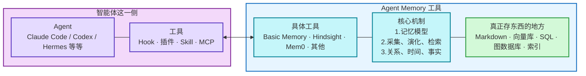
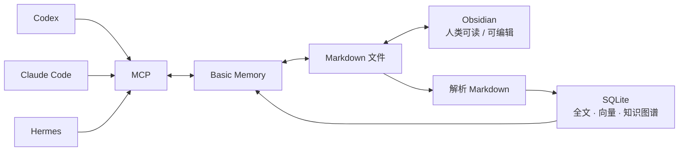

## Agent Memory：原生记忆和长期经验系统
Agent Memory（智能体记忆）解决的核心问题，是让智能体跨会话、跨任务甚至跨不同 Agent 保留真正有价值的信息，并在未来需要时重新找到、更新和利用这些信息。
一套完整的记忆系统通常要处理：获取信息 → 判断什么值得记 → 保存 → 检索 → 更新 → 合并 → 遗忘 → 从经历中归纳经验。

理解 Agent Memory 时最重要的一点是：**记忆越多不等于 Agent 越聪明。真正影响效果的是记了什么、什么时候取回来、旧信息如何更新，以及过去经历能否改变未来行为。**

### Agent Memory 是什么
长期使用 Codex、Claude Code、Hermes 一类 Agent 时，至少存在三种不同的信息机制：

| 类型 | 主要作用 | 典型内容 |
|---|---|---|
| 当前上下文 | 完成眼前任务 | 当前对话、代码、工具结果、计划 |
| 长期指令 | 告诉 Agent 必须怎样工作 | `AGENTS.md`、`CLAUDE.md`、项目规则 |
| 长期记忆 | 保存以后可能有用的信息 | 用户偏好、项目事实、历史决策、调试经验 |

Agent Memory 的意义，就是避免每次新会话都重新解释一些有长期价值的信息。

### Agent 原生 Memory 机制

| Agent           | 如何开启                                                                                                              | 开启后会发生什么                                                                              | 想主动写入一条记忆                                                                  | 用户平时要做什么                                                       |
| --------------- | ----------------------------------------------------------------------------------------------------------------- | ------------------------------------------------------------------------------------- | -------------------------------------------------------------------------- | -------------------------------------------------------------- |
| **Codex**       | Desktop：`Settings → Personalization → Enable memories`；或 `config.toml` 中设置 `memories = true`                      | Codex 会从过去的 Session 中自动提炼长期有用的信息，保存到 `~/.codex/memories/`，以后需要时参考                     | **不建议直接改 Memory 文件。** 普通使用不需要主动写；如果是必须长期遵守的规则，应写入 `AGENTS.md`              | 主要维护 `AGENTS.md`。Memory 基本让 Codex 自动管理，偶尔检查即可                  |
| **Claude Code** | **默认已开启**；`/memory` 可查看和管理，也可在设置中关闭                                                                               | Claude 会把构建命令、踩坑经验、用户偏好等保存到 `~/.claude/projects/<project>/memory/`                    | **直接在对话里说“记住……”即可。** Claude 会自己写入 Memory；也可以直接编辑 `MEMORY.md`               | 平时让 Claude 自动记，偶尔用 `/memory` 检查、删除错误或过期内容。必须遵守的规则写 `CLAUDE.md` |
| **Hermes**      | 原生 Memory 默认可用；通过配置中的 `memory.memory_enabled` 控制。`hermes memory setup` 主要是配置**第三方 Memory Provider**，不是开启原生 Memory | Hermes 会把少量长期信息写入 `~/.hermes/memories/MEMORY.md` 和 `USER.md`；完整历史保存在 `state.db`，需要时搜索 | **直接告诉 Hermes“记住……”即可。** 它会调用 Memory Tool 写入；也可以人工编辑 `MEMORY.md / USER.md` | Memory 文件容量很小，只放高价值信息。建议开启写入审批，定期清理错误或过期记忆                     |

### 第三方 Agent Memory

#### 原生 Memory 的主要缺口

| 问题 | 实际表现 | 第三方 Memory 提供的能力 |
|---|---|---|
| Agent 之间割裂 | Claude Code 知道，Codex 不知道 | 共用一套 Memory |
| 历史越来越多 | Markdown 或摘要无法高效覆盖大量历史 | 全文、向量和混合检索 |
| 重复踩坑 | Agent 每次重新尝试已经失败过的方法 | 保存情景/经历记忆 |
| 事实变化 | 新旧事实同时被找回来 | 时间、版本、冲突处理 |
| 只记不学 | 保存了大量历史但行为没有改变 | 反思、归纳、认知模型、Skill 演化 |
| 多设备或多人 | 本地记忆无法自然共享 | 云端或服务器式 Memory |

#### 主流 Agent Memory 解决方案对比

不同的产品解决不同的核心问题：

| 路线 | 主要解决的问题 | 代表工具 |
|---|---|---|
| 人类可控型 | 人和 AI 共用、可直接编辑的长期知识 | Basic Memory |
| 编码经验型 | 保存 Coding Agent 的调试和工作经历 | AgentMemory、claude-mem |
| 通用画像型 | 用户偏好、用户事实、多应用共享上下文 | Mem0、Supermemory |
| 本地综合型 | 用较少基础设施实现高级 Memory | Mnemosyne |
| 经验成长型 | 从经历形成认知、策略或技能 | Hindsight、MemOS、Letta |
| 时间图谱型 | 处理实体关系和不断变化的事实 | Graphiti / Zep |

详细对比表格：

| 工具 / GitHub 热度                       | 分组   | 核心定位                      | 主要记忆                  | 数据与存储                                  | 检索 / 学习                  | 写入方式                        | Codex / Claude Code / Hermes                         | 部署 / 数据位置               | 关键判断                              |
| ------------------------------------ | ---- | ------------------------- | --------------------- | -------------------------------------- | ------------------------ | --------------------------- | ---------------------------------------------------- | ----------------------- | --------------------------------- |
| **Basic Memory**⭐ 约 3.7k             | 人类可控 | Markdown 人机共享知识库          | 事实、研究、决策、知识关系         | Markdown 为主，本地索引为辅                     | 关键词 + 语义检索 + WikiLink 关系 | 用户或 Agent 主动写；插件可自动捕获       | Codex：MCPClaude：MCP/插件Hermes：插件                      | 本地优先；可选云端同步             | 最适合 Obsidian、PKM 和重视数据可控性的个人用户    |
| **AgentMemory**⭐ 约 27.1k             | 编码经验 | 多 Coding Agent 共享项目经验     | 调试经验、失败路径、历史决策、项目上下文  | 内置键值数据库 + 内存向量索引                       | 关键词 + 向量 + 关系图混合检索       | 钩子（Hook）自动捕获，也可主动保存         | Codex / Claude / Hermes 均有插件或 MCP 集成                 | 主要本地运行                  | 很适合跨 Agent 的编码工作连续性，但应关注记忆隔离和噪声   |
| **claude-mem**⭐ 约 90.9k              | 编码经验 | 自动保存 Coding Session 工作过程  | 工具调用、调试、操作观察、会话摘要     | SQLite + 向量数据库（Chroma）                 | 全文 + 向量检索 + 分层展开         | Hook 自动捕获会话生命周期             | Claude 最成熟；Codex、Hermes 已支持                          | 本地                      | 热度很高，但与主流 Agent 原生 Memory 的重叠正在增加 |
| **Mem0**⭐ 约 63.4k                    | 通用画像 | AI 应用的通用用户记忆层             | 用户事实、偏好、历史事件、Agent 状态 | 可插拔普通数据库 + 向量存储                        | 向量 + 关键词 + 实体 + 时间检索     | API / SDK 输入后自动提取           | Codex / Claude：技能或 APIHermes：官方 Provider             | 云端或自托管                  | 生态和通用性强，更偏 AI 应用基础设施              |
| **Supermemory**⭐ 约 28.9k             | 通用画像 | 跨 AI 工具共享用户上下文            | 用户画像、项目上下文、历史讨论、文档知识  | 数据库 + 向量索引                             | 知识检索 + 个性化记忆 + 事实更新      | 自动提取，也可主动保存                 | Claude：插件Hermes：官方 Provider Codex：MCP                | 云端或本地                   | 适合希望把个人上下文跨多个 AI 工具共享的用户          |
| **Mnemosyne**⭐ 约 2.5k                | 本地综合 | 单机实现较完整的高级 Memory         | 事实、经历、重要度、有效期、时间关系    | 单文件 SQLite + 向量/全文索引                   | 全文 + 向量 + 时间/重要度 + 时间关系  | MCP / 插件 / SDK；支持后台整合       | Codex / Claude：MCPHermes：第三方插件                       | 完全本地                    | 适合重视隐私，又希望使用数据库型高级 Memory 的个人用户   |
| **Hindsight**⭐ 约 20.0k               | 经验成长 | 从经历形成更高层认知                | 事实、经历、实体关系、认知模型       | PostgreSQL / 内嵌 PG + 向量/图索引            | 语义 + 关键词 + 图关系 + 时间 + 反思 | Retain 自动抽取；支持后台整合和 Reflect | Codex / Claude：官方 Coding Agents 集成Hermes：官方 Provider | 本地、Docker、自托管或云端        | 最典型的“经历 → 反思 → 认知”成长型方案           |
| **MemOS**⭐ 约 10.7k                   | 经验成长 | 管理多类 Memory 并演化策略与 Skill  | 事实、工具轨迹、策略、世界模型、技能    | 完整版：图数据库 + 向量数据库本地插件：SQLite + Skill 文件 | 混合检索 + 调度 + 反馈纠正 + 技能演化  | 自动处理；可根据反馈持续学习              | Hermes 集成最深；Codex / Claude 可经 API/MCP 接入             | 云端、自托管或本地插件             | 成长理念很强，但完整版与本地插件必须分开理解            |
| **Letta（原 MemGPT）**⭐ 约 24.3k         | 经验成长 | 把 Memory 作为有状态 Agent 自身机制 | 长期状态、历史消息、外部资料、自维护上下文 | Letta Server 统一管理状态与 Memory            | Agent 主动读写、重组长期状态        | Agent 运行过程中主动维护             | 不是 Codex / Claude / Hermes 的主流外挂路线                   | 云端或自托管                  | 研究价值高，更适合直接构建 Letta Agent         |
| **Graphiti / Zep**⭐ Graphiti 约 30.0k | 时间图谱 | 处理实体关系和不断变化的事实            | 实体、事件、关系、来源、有效时间      | 图数据库 + 向量/全文索引                         | 图关系 + 向量 + 关键词 + 时间检索    | 写入事件后自动抽取实体和关系              | 主要通过 MCP 等通用方式接入                                     | Graphiti 可自托管；Zep 有云端服务 | 复杂关系和时间变化场景很强，普通个人用户通常偏重          |

总体架构：



#### Agent Memory 排行榜应该怎么看

目前常见的 Memory Benchmark（记忆评测）包括 LoCoMo、LongMemEval、BEAM 等。

这些评测不能直接把不同项目官网公布的分数拿来排大小，因为它们可能使用：不同数据集 → 不同大模型 → 不同检索数量 → 不同提示词 → 不同评分模型 → 不同云端/开源版本。
因此：Hindsight 的某个 90 分，不等于一定比 Mem0 的某个 88 分强。分数只有在**相同测试协议**下才具有直接横向比较价值。

Agent Memory Leaderboard（AML）的价值就在这里：它尝试把参赛 Memory 系统主要限制在“写入”和“检索”能力上，再统一后续回答模型与评分模型，从而减少“产品用了更强大模型所以分更高”的污染。

AML 还把 Memory 拆成多个能力维度，并单独关注 Coding Agent 的：

- 调试记忆：过去的错误、修复和失败经验能不能复用；
- 开发记忆：过去的架构决定和工程知识能不能重新利用。

这比单纯测试“AI 是否记得用户喜欢什么”更接近 Coding Agent 的真实工作。


#### 第三方 Memory 应该怎样选

选择顺序应该从问题出发：

原生 Memory 已经够用 → 不安装第三方。
需要 Obsidian、人类可读、不同 Agent 共享知识 → Basic Memory。
需要 Coding Agent 自动保存失败路径和历史工作经验 → AgentMemory 一类工具。
需要为 AI 应用维护用户画像和长期事实 → Mem0 / Supermemory。
希望 Agent 从经历中反思并形成认知 → Hindsight。
希望进一步管理记忆生命周期，并把高价值经验演化成 Skill → MemOS。
需要处理复杂实体关系和事实随时间变化 → Graphiti / Zep。

不要反过来因为某个项目 GitHub Star 很高，就先装上再找用途。

## Basic Memory：轻量、人类可控的长期知识层


Basic Memory 代表了一条非常明确的路线：**Markdown 才是用户真正拥有的数据，数据库和搜索系统只是辅助层。**
它让人和多个 Agent 直接读写同一批 Markdown。

### Basic Memory 的结构




**Markdown 是真正的长期知识资产。所以即使未来 Basic Memory 停止维护，你的核心数据仍然只是普通 Markdown。**

### 本地安装

Basic Memory 当前要求 Python 3.12+。
使用 `uv`命令在本地安装basic-memory：

```bash
# 安装 Basic Memory CLI。
uv tool install basic-memory

# 确认安装成功。
basic-memory --version
```


默认知识目录通常位于：`~/basic-memory/`。
可以运行：
```bash
basic-memory status
basic-memory project list
```
检查当前状态和项目。

### 创建 Basic Memory Project
比如你想要在这个本地文件夹内保存你的智能体长期记忆：`~/jason-memory/`。（注意，也可以指定你的Obsidian Vault中的特定文件夹，这样一来就可以把它作为你的长期知识资产了。）
先创建并设为默认 Project：
```bash
bm project add "jason-memory" '/Users/jason/Obsidian/my-ob-vault/90 - System/Memory'
bm project default "jason-memory"
```
一个 Project 本质就是一个独立知识库；需要互相搜索、建立 Wiki Link 和关系的内容，应该放在同一个 Project。

### 连接 Codex、Claude Code 和 Hermes 并进行初始化

来到智能体中，安装插件，并运行初始化命令，分别为不同的 Agent 绑定这个project：

#### Codex
Codex版本的Plugin 自带 MCP、Skills 和 Hooks。
```bash
# 注册 Basic Memory Plugin marketplace
codex plugin marketplace add basicmachines-co/basic-memory
# 安装 Plugin
codex plugin add codex@basic-memory
```
然后`$bm-setup` 然后选择`primaryProject = jason-memory`，它会写入 `~/.codex/basic-memory.json` 或当前项目的 `.codex/basic-memory.json`。
#### Claude Code
**目前Claude Code的plugin不带MCP**，这个要注意。所以完整安装命令是：
```bash
# 1. 连接 Basic Memory MCP
claude mcp add basic-memory -- uvx basic-memory mcp

# 2. 注册 Basic Memory Plugin marketplace
claude plugin marketplace add basicmachines-co/basic-memory \
  --sparse .claude-plugin plugins/claude-code

# 3. 安装 Plugin
claude plugin install basic-memory@basicmachines-co
```
然后`/basic-memory:bm-setup` 然后选择`jason-memory`作为primaryProject。这个命令会完成 Project 映射、Schema 初始化等配置。
#### Hermes Agent

Hermes特有的插件安装机制，可以直接安装Plugins：
```bash
# 1. 安装 Basic Memory Plugin
hermes plugins install basicmachines-co/basic-memory/integrations/hermes

# 2. 初始化并选择 Basic Memory 作为记忆系统，然后设置`project = jason-memory`
hermes memory setup basic-memory

# 3. 检查状态
hermes memory status
```


最终效果：三个智能体统一使用同一个记忆库。
```text
		~/jason-memory/
			  │
		Basic Memory
			  │
  ┌───────────┼───────────┐
  ↓           ↓           ↓
Codex      Claude Code   Hermes
```


**安装官方通用skills**
`plugin add`命令只会安装bm skill。
```text
basic-memory/
├── plugins/
│   ├── codex/skills/          ← Codex Plugin 专用 bm-* Skills
│   └── claude-code/skills/    ← Claude Plugin 专用 bm-* Skills
│
└── skills/                    ← 跨 Agent 通用 memory-* Skills
```
而官方还提供了一套通用skills：
```bash
npx skills add basicmachines-co/basic-memory/skills
```


**plugin自带的skills以及官方额外提供的skills**

| Skill                      | 来源                                                       | 核心功能                                                                       | 平时怎么用更合适                                                        | 日常重要性 |
| -------------------------- | -------------------------------------------------------- | -------------------------------------------------------------------------- | --------------------------------------------------------------- | ----- |
| `bm-setup`                 | 🔵 Plugin 自带：Codex / Claude Code                         | **第一次配置 Basic Memory。**选择使用哪个 Memory Project、记忆保存到哪里、是否开启自动记录等             | **首次安装后手动运行一次。**以后一般不用管                                         | ⭐⭐⭐⭐⭐ |
| `bm-orient`                | 🔵 Plugin 自带：Codex / Claude Code                         | **“看看我们之前做到哪了”。**读取最近任务、决定和工作记录，恢复上下文                                      | 主要让 Agent 在继续旧任务时自己用；你也可以主动说“恢复之前的工作”                           | ⭐⭐⭐⭐⭐ |
| `bm-checkpoint`            | 🔵 Plugin 自带：Codex / Claude Code                         | **保存当前工作进度快照。**记录目标、已经做了什么、未解决问题和下一步                                       | 插件在上下文压缩时会配合自动使用；你结束重要工作前也可以主动调用                                | ⭐⭐⭐⭐⭐ |
| `bm-decide`                | 🔵 Plugin 自带：Codex / Claude Code                         | **专门保存重要决定。**不仅记“选了什么”，还记为什么这么选、放弃了什么方案                                    | 重要决定最好让 Agent 主动识别；特别重要时你也可以明确说“记录这个决定”                         | ⭐⭐⭐⭐⭐ |
| `bm-remember`              | 🔵 Plugin 自带：Codex / Claude Code；Hermes 有 `/bm-remember` | **快速记住一件事。**适合你明确说“记住这个”                                                   | **主要给用户主动触发。**例如“记住以后技术调查优先官方资料”                                | ⭐⭐⭐⭐⭐ |
| `bm-share`                 | 🔵 Plugin 自带：Codex / Claude Code                         | 把个人 Basic Memory 中的一篇记忆复制到团队共享 Project                                     | 只有使用 Basic Memory Cloud 团队空间时才手动用                               | ⭐     |
| `bm-status`                | 🔵 Plugin 自带：Codex / Claude Code；Hermes 有对应状态命令          | 查看 Basic Memory 是否正常、当前使用哪个 Project、最近有没有成功保存                              | 出现问题或刚配置完成时手动检查                                                 | ⭐⭐⭐   |
| `bm-writing`               | 🔵 Plugin 自带：Codex / Claude Code                         | **规定 Agent 写记忆时应该怎么写。**包括结构、表达方式、关系链接等                                     | 主要交给 Agent 自动使用。用户一般不主动调用；想改变记忆写法时才修改它                          | ⭐⭐⭐⭐  |
| `basic-memory`             | 🔵 Hermes Plugin 自带                                      | Hermes 的“Basic Memory 使用说明”。告诉它什么时候搜索记忆、什么时候写记忆，以及怎样使用 `bm_*` 工具           | **交给 Hermes 自动使用即可**，通常不需要用户主动调用                                | ⭐⭐⭐⭐⭐ |
| `memory-notes`             | 🟢 官方通用 Skill，需通过 `npx skills add` 安装                    | **教 Agent 怎样写一篇规范的 Basic Memory 笔记。**怎么写标题、事实、关系、Wiki Link，并强调写之前先搜索旧记忆    | 主要让 Agent 自动参考，不需要你频繁手动调用                                       | ⭐⭐⭐⭐⭐ |
| `memory-reflect`           | 🟢 官方通用 Skill                                            | **回顾最近的聊天和 Session，把真正值得长期留下的信息挑出来。**例如重要决定、经验、长期偏好                        | **适合主动或定期执行。**例如每天一次；以后我们最好改成符合自己 `core/`、`projects/` 等结构的版本    | ⭐⭐⭐⭐⭐ |
| `memory-capture`           | 🟢 官方通用 Skill                                            | **把当前这场讨论整理成一篇干净的总结。**不是聊天流水账，而是记录最终结论                                     | 一场重要研究、规划或讨论结束时可以手动调用；Codex/Claude 已有 checkpoint，所以不用每次都用       | ⭐⭐⭐   |
| `memory-continue`          | 🟢 官方通用 Skill                                            | **恢复以前做过的事情。**搜索相关 Memory，然后把必要背景重新读出来                                     | 用户说“继续上次那个项目”时让 Agent 自动用；Codex/Claude 已有 `bm-orient`，所以有一定重复   | ⭐⭐⭐   |
| `memory-reflect`           | 🟢 官方通用 Skill                                            | 从最近多次工作记录中提炼真正的长期记忆，而不是简单保存 Session                                        | **这是最适合定期主动运行的 Skill 之一**                                       | ⭐⭐⭐⭐⭐ |
| `memory-ingest`            | 🟢 官方通用 Skill                                            | **把旧资料导入 Basic Memory。**例如旧 Codex Memory、Claude Memory、聊天记录、会议记录等，整理成结构化记忆 | **主要由用户主动使用。**尤其适合你第一次迁移旧长期记忆时                                  | ⭐⭐⭐⭐  |
| `memory-lifecycle`         | 🟢 官方通用 Skill                                            | **管理记忆的“生命周期”。**例如项目结束后不要删除，而是移动到归档；旧状态被新状态替代                              | 日常可以交给 Agent判断；大规模整理时可以主动调用                                     | ⭐⭐⭐⭐  |
| `memory-defrag`            | 🟢 官方通用 Skill                                            | **给记忆库“大扫除”。**找重复内容、过时信息、越来越臃肿的文件，然后合并或拆分                                  | 建议隔一段时间主动执行，例如几周一次，而不是每天用                                       | ⭐⭐⭐⭐  |
| `memory-curate`            | 🟢 官方通用 Skill                                            | **整理记忆之间的关系。**找孤立笔记、重复主题、缺失链接，把整个知识图谱整理得更好                                 | Memory 积累比较多以后偶尔主动运行                                            | ⭐⭐⭐   |
| `memory-tasks`             | 🟢 官方通用 Skill                                            | **把 Basic Memory 当任务管理器。**保存多步骤任务、进度、当前状态，跨 Session 继续                     | 只有你确实希望 Basic Memory 同时管理任务时使用；否则不必主动用                          | ⭐⭐    |
| `memory-schema`            | 🟢 官方通用 Skill                                            | **规定同一类记忆应该有哪些固定字段。**例如“项目”“决定”“会议”都使用统一结构                                 | 初期基本不用管；Memory 规模很大、结构开始混乱后再使用                                  | ⭐⭐    |
| `memory-metadata-search`   | 🟢 官方通用 Skill                                            | 按固定字段精确找记忆。例如“找所有还没完成的项目”“找优先级高的任务”                                        | 大多数时候让 Agent 自动使用；只有做复杂筛选时才明显有价值                                | ⭐⭐    |
| `memory-research`          | 🟢 官方通用 Skill                                            | **做网络调查后，把研究结果直接整理进 Basic Memory。**还会先看看已有记忆，避免重复研究                        | 适合明确说“调查这个主题并保存进 Basic Memory”时使用；不是每次搜索都需要                     | ⭐⭐⭐   |
| `memory-onboarding`        | 🟢 官方通用 Skill                                            | **帮新用户从零设计一套 Basic Memory。**会询问需求，然后创建结构、规则、入口文件等                          | 基本是**一次性主动运行**；而我们已经自己设计 `START.md` 和 `MEMORY_POLICY.md`，价值反而降低 | ⭐⭐    |
| `memory-literary-analysis` | 🟢 官方通用 Skill                                            | 专门把一本书拆成角色、主题、章节、地点等结构化记忆                                                  | 只有分析小说、书籍时才主动用，对日常 Agent Memory 几乎没用                            | ⭐     |


### Agent 的原生 Memory 文件是否会与 Basic Memory 冲突？
Basic Memory 官方不主张把 Agent 原生 Memory 全部删除。
官方文档有一篇：[Using Basic Memory with Built-in AI Memory](https://docs.basicmemory.com/concepts/vs-built-in-memory)

> Built-in memory = short-term cache  (Agent 原生 Memory → 小型、工具专属、快速加载)
> Basic Memory = long-term store (Basic Memory → 大型、结构化、跨 Agent 的长期知识)

### 初始化，以及Basic Memory的文件结构设计

#### 方式一：memory-onboarding skill
`memory-onboarding skill` 会执行以下流程：调查需求 → 提出目录结构 → 让用户批准 → 创建规则、结构、Note → 创建真实示例 → 配置 Agent 启动时如何读取。

文件夹示例：
```markdown
basic-memory-project/
├── instructions/                              ← 系统入口和各类长期操作规则
│   ├── 启动路由.md                             ← AI 使用知识库前首先读取的场景路由
│   ├── Basic Memory 使用速查.md                ← 面向用户的常用指令、Skill 和维护入口
│   ├── 个人上下文规则.md                        ← 个人背景与当前方向的读取、更新边界
│   ├── AI 协作规则.md                          ← 根据任务场景加载对应输出偏好
│   ├── 项目知识规则.md                          ← 项目摘要、状态和关键决策的维护规则
│   └── 记忆迁移规则.md                          ← 从对话、笔记和项目仓库提炼长期记忆
│
├── profile/                                   ← 相对稳定的个人背景与阶段性方向
│   ├── Jason 的个人背景.md                     ← Jason 的稳定背景、能力范围和常用环境
│   └── Jason 的当前工作方向.md                 ← 当前 Jason 的主要工作方向
│
├── preferences/                               ← AI 在不同任务场景下需要遵守的偏好
│   ├── 通用协作偏好.md                          ← 默认加载的沟通方式和协作边界
│   ├── 写作与输出规范.md                        ← 普通写作、技术解释和真实性要求
│   ├── Markdown 知识笔记规范.md                ← 输出完整 Markdown 知识笔记时的格式
│   ├── 目录与架构展示规范.md                    ← 文件夹和项目架构的树形展示格式
│   └── 技术结构与 Mermaid 规范.md              ← 流程、依赖和 Mermaid 图表的使用规则
│
├── projects/                                  ← 项目级长期摘要和统一入口
│   ├── 项目索引.md                              ← 所有长期项目的状态、阶段和入口
│   └── {repository-slug}/                     ← 使用稳定仓库标识区分不同项目
│       └── {项目中文名称}.md                    ← 项目目标、阶段、关键下一步和来源入口
│
├── codex/                                     ← Codex 插件管理的工作记忆
│   ├── decisions/                             ← 需要跨会话保留的正式决策
│   │   └── {项目名称：决策主题}.md              ← 决策内容、理由、替代方案和长期影响
│   │
│   └── {workspace-name}/                      ← 按工作区保存 Codex 恢复记录
│       └── Codex checkpoint - {时间} - {主题}.md
│                                               ← compact 后生成的不可变工作交接快照
│
├── templates/                                 ← 创建结构化记忆笔记时使用的中文模板
│   ├── 个人上下文模板.md                        ← 个人背景和当前方向模板
│   ├── 偏好规范模板.md                          ← 场景化偏好模板
│   ├── 项目摘要模板.md                          ← 项目目标、状态和下一步模板
│   ├── 决策模板.md                              ← 决策、理由、替代方案和影响模板
│   ├── 指令笔记模板.md                          ← 路由和领域规则模板
│   ├── Codex 会话模板.md                       ← Codex 会话与恢复记录模板
│   └── Codex 任务模板.md                       ← 需要跨会话追踪的任务模板
│
└── schemas/                                   ← 定义各类笔记必须遵守的数据结构
    ├── 个人上下文.md                            ← 个人背景类笔记的字段和状态规范
    ├── 偏好规范.md                              ← 场景化偏好笔记的字段规范
    ├── 项目.md                                  ← 项目摘要的目标、状态和下一步规范
    ├── 决策.md                                  ← 长期决策的理由、影响和关系规范
    ├── 指令.md                                  ← 启动路由和领域规则的结构规范
    ├── Codex 会话.md                           ← checkpoint 与会话记录规范
    └── Codex 任务.md                           ← 跨会话任务的状态和字段规范
```

#### 方式二：用户主导
自己来设计文件夹结构。思考：对你来说，哪些类别的记忆应该保存：

| 类型    | 目录            | 本质              | 主要写入方式                      |
| ----- | ------------- | --------------- | --------------------------- |
| 核心记忆  | `core/`       | “用户是谁”          | Reflection 为主；极明确事实可即时更新    |
| 当前上下文 | `context/`    | “现在最关心什么”       | Agent + Reflection 持续更新     |
| 程序记忆  | `procedures/` | “以后应该怎么做”       | Reflection 提炼经验后更新          |
| 项目记忆  | `projects/`   | “这个长期项目现在是什么状态” | Agent 工作时更新 + Reflection 校正 |
| 决策记忆  | `decisions/`  | “为什么做出这个重要选择”   | **即时捕获为主**                  |
| 情景记忆  | `sessions/`   | “某次工作具体发生过什么”   | **Plugin / Hook 自动生成**      |
| 历史记忆  | `archive/`    | “以前有效、现在已失效的内容” | Reflection / Lifecycle 移入   |

然后让智能体为你构建。

### 现有 Agent 项目如何提炼memory

1. 有旧聊天文本（比如GPT聊天记录）、旧 Memory 文件、文档：`memory-ingest skill`
2. 某个特别重要的长对话：`memory-capture skill`
3. 完整的、已完成的项目：
```markdown
只读审计当前项目，并为 jason-memory 提炼长期项目记忆。

先读取 Basic Memory 的“启动路由”和现有项目笔记，再检查仓库中的 AGENTS.md、README.md等重要文档以及关键配置和必要代码。

只保留具有长期价值的项目目标、当前阶段、关键下一步、关键决策和设计理念。不要把临时任务、完整代码细节、日志或普通开发过程写入长期记忆。

先与现有记忆去重，向我提供：
1. 建议新增或更新的内容；
2. 对应的目标笔记；
3. 信息依据；
4. 不建议保存的内容及原因。

暂时不要写入 Basic Memory，等我确认。
```
4. 然后就可以正常使用了：
```markdown
新工作
→ Plugin 自动产生 Session / Checkpoint
→ bm-decide 保存关键决定
→ bm-remember 保存明确事实
→ memory-ingest 导入 ChatGPT 对话、Obsidian 笔记或外部文档时
→ memory-capture 一段重要长对话结束，需要提炼当前结论时。
→ projects/*.md 持续更新
```

### Wiki Link 以及与 Obsidian 结合
[Basic Memory 官方文档](https://docs.basicmemory.com/integrations/obsidian/)明确写：
>Because Basic Memory uses standard markdown with wiki links, Obsidian understands your knowledge base natively.

所以Basic Memory 自己会解析双链语法。
Basic Memory 官方甚至专门建议把它的目录直接作为 Obsidian Vault，并使用 Graph View、Backlinks、Tags。
```text
			 同一套 Markdown
				  │
	  ┌───────────┴───────────┐
	  ↓                       ↓
   Human                     AI
	  ↓                       ↓
  Obsidian                  MCP
  VS Code                  Codex
  Git                      Claude
```


### 如何保证Agent 每次都读取长期记忆？

官方明确说：
> Connecting Basic Memory over MCP gives your assistant the tools. It doesn't teach it when to reach for them.
所以：有 MCP ≠ Agent 一定会调用 MCP。

Basic Memory给出三种方案：

**方案一：编写AGENTS.md和CLAUDE.md**
```markdown
## Basic Memory

在回答有关过往工作、决策、偏好或项目历史的问题之前，优先检索基础记忆库。 
使用「my‑memory」项目。 
开启新会话时，在开展实质性工作前，加载启动路由以及相关的有效上下文。
```

**方案二：Skills**
```bash
npx skills add basicmachines-co/basic-memory/skills
```
里面有 `memory-notes`、`memory-onboarding`、`memory-ingest`、`memory-continue`、`memory-curate`、`memory-defrag` 等。
Skills 会告诉 Agent：什么情况下搜索、怎么写 Note、怎么恢复上下文、怎么维护 Graph。但是 Skill 依然属于 Agent 行为层，而不是强制生命周期事件。

**方案三：Plugin + Hooks**
Plugin + Hooks 可以让“每次 session 尝试恢复记忆”成为默认生命周期行为，但 Basic Memory 有意没有设计成记忆失败就禁止 Agent 工作。

| 内容                       | 作用                                     |
| ------------------------ | -------------------------------------- |
| `.mcp.json`              | 自动配置 Basic Memory MCP                  |
| `hooks/hooks.json`       | 注册生命周期 Hooks                           |
| `hooks/session_start.py` | Session 启动                             |
| `hooks/pre_compact.py`   | Context 压缩前                            |
| `skills/`                | Codex 专用工作流                            |
| `schemas/`               | Codex Session / Decision / Task schema |

### 智能体如何保存和更新长期记忆？

| 机制          | 本质      | 解决的问题                     | 不负责什么           |
| ----------- | ------- | ------------------------- | --------------- |
| MCP         | 工具接口    | “怎么写”                     | 不决定什么时候写        |
| `AGENTS.md` | 常驻规则    | “什么值得写”                   | 不保证某个时刻一定执行     |
| Skill       | 工作流程    | “发现候选记忆后，具体怎么判断、分类、去重、写入” | 不负责触发时机         |
| Hook        | 生命周期触发器 | “什么时候执行某件事”               | 自己不会判断信息有没有长期价值 |
| 定时任务        | 周期触发器   | “每天/每隔多久整理一次”             | 不定义整理规则         |

AGENTS.md 样例：
```markdown
## Long-term Memory

Basic Memory 是跨 Agent 的长期记忆真源。

主动保存真正具有长期价值的信息，而不是等待用户明确说“记住”：

- 稳定的用户事实、偏好和长期约束；
- 用户做出的明确且会影响未来工作的决定；
- 长期有效的工作方法、经验和教训；
- 项目的重要状态变化、目标和未解决问题。

不要把普通聊天、临时状态、未经确认的猜测直接写入长期记忆。

不确定长期价值的信息先保留在 session/checkpoint。

写长期记忆前先搜索已有 Note：
- 已存在 → 更新；
- 已过期 → 替换或标记 superseded；
- 不存在 → 创建。

Basic Memory 是长期事实源，不要同时维护另一套重复长期记忆。
```

不同智能体的记忆写入能力：

|自动写长期记忆的能力|Codex|Claude Code|Hermes|
|---|---|---|---|
|用户明确说“记住这个”|✅ 自带 `bm-remember` Skill，可以直接写入 Basic Memory|✅ 自带 `bm-remember` 等 Skill|✅ 自带 `/bm-remember` 和写入工具|
|用户明确做出一个重要决定时，保存这个决定|✅ 自带 `bm-decide` Skill；Agent 可以调用它保存“决定 + 原因 + 影响”|✅ 自带决定记录能力，而且官方插件还能要求 Claude 主动识别重要决定并保存|⚠️ 有 Basic Memory 写入工具，但没有 Claude 那么完整的“自动识别重要决定”规则；建议额外配置记忆写入规则|
|对话太长、上下文即将压缩时，自动保存当前工作进度|✅ 自带 Hook，会保存 checkpoint（工作进度快照）|✅ 自带 Hook，会在压缩前保存当前工作|❌ 不采用这种机制；Hermes 走的是“每轮自动记录”路线，不需要另外补这个 Hook|
|自动记录每一轮聊天内容|❌ 默认不记录每一轮；也不建议额外开启，否则记忆量会非常大|❌ 默认不记录每一轮；也不建议额外开启|✅ 自带，每轮用户和 Agent 的对话都会写入 Session 记录|
|一次会话结束后，自动生成会话总结|⚠️ 有 checkpoint，但不是“每次聊天结束自动总结”；如确实需要，可额外安装官方 `memory-capture` Skill|⚠️ 有 checkpoint；需要更完整的会话总结时，可额外安装官方 `memory-capture` Skill|✅ 自带，Session 结束时自动生成 Summary（会话总结）|
|从最近多个会话里，自动找出“哪些内容值得成为真正长期记忆”|⚠️ 需要额外安装 Basic Memory 官方 `memory-reflect` Skill|⚠️ 需要额外安装/启用官方 `memory-reflect` Skill|⚠️ 需要额外安装官方 `memory-reflect` Skill|
|自动发现“用户形成了一个新的长期偏好”，并更新 `core/preferences.md`|❌ 官方 `memory-reflect` 默认不知道我们自己的 `core/preferences.md` 结构；需要修改或创建自己的长期记忆整理 Skill|❌ 同左，需要自定义长期记忆整理 Skill|❌ 同左，需要自定义长期记忆整理 Skill|
|自动把记忆正确分类到 `core/`、`context/`、`procedures/`、`projects/`、`decisions/`|❌ 需要我们自己定义 `MEMORY_POLICY.md`，并让自定义 Skill 按这个规则写|❌ 同左|❌ 同左|
|写新记忆前先搜索旧记忆，避免重复|⚠️ Basic Memory 官方 Skill 已经有“先搜索再创建”的原则，但我们的长期记忆整理 Skill仍应明确写入这条规则|✅ Claude Basic Memory 插件对此支持比较完整，会主动搜索已有记忆|⚠️ 有搜索工具，但长期记忆整理时仍需在 Skill 中明确要求“先搜再写”|
|新信息和旧记忆冲突时，自动更新旧内容，而不是同时保留两个矛盾版本|❌ 需要我们自己的长期记忆整理 Skill 定义“更新、替代、保留历史”的规则|❌ 同左|❌ 同左|
|自动把已经过期的当前状态移入 `archive/`|⚠️ Basic Memory 官方有 `memory-lifecycle` Skill，可以额外安装，用来移动、归档过期内容|⚠️ 可额外安装官方 `memory-lifecycle` Skill|⚠️ 可额外安装官方 `memory-lifecycle` Skill|
|定期整理整个长期记忆库，例如每天检查一次最近 Session|❌ Agent 插件本身不会每天自动执行；需要定时任务调用 `memory-reflect` 或我们的自定义 Skill|❌ 同左|❌ 同左；Hermes 虽然记录得最勤，但也不会自动完成这种长期整理|

### 平时应该怎么使用 Basic Memory

Basic Memory 更适合**有意识地保存高价值知识**，而不是把每一句对话都自动塞进去。

| 需求 | 示例提示 |
|---|---|
| 保存项目决定 | “把我们为什么放弃方案 A、最终选择方案 B 的原因保存到 Basic Memory。” |
| 保存研究结论 | “把今天关于 Hindsight 的核心结论整理进长期知识，并保留来源。” |
| 查找过去知识 | “搜索 Basic Memory，看看以前有没有研究过类似的 Agent Memory 方案。” |
| 继续旧项目 | “读取这个项目过去的决策、当前状态和未完成事项，然后继续工作。” |
| 修正旧知识 | “找到之前关于这个工具安装方式的笔记，按照最新版本更新，不要新建重复笔记。” |

真正好的使用方式不是：保存今天全部聊天记录。而是：把真正值得以后重新使用的结论、理由和经验整理成长期知识。


### 多智能体协同中的作用

Basic Memory 为多个 Agent 提供共享的长期知识与交接层，用于保存项目目标、关键决策、协作约束、验证结果和任务 checkpoint。它能减少重复调查与认知分叉，让不同 Agent 在跨任务、跨对话和上下文压缩后，仍能基于一致信息继续工作。

它不负责实时调度、消息传递或文件冲突处理，也不能替代代码、数据库和项目文档这些事实来源。

### 场景举例：跨对话记忆
当我和 Codex 聊了几十轮对话，然后开启了一个新对话，新对话中如何记住之前聊过的信息？

**第一种：是重要信息直接保存：**
当你明确在对话中要求保存重要信息和决策的时候，`bm-decide`和`bm-remember`会记录进 Basic Memory 长期记忆，后续即使这个 Codex 对话彻底删除，Markdown 文件还在。

**第二种：跨长会话最关键的`bm-checkpoint`。**
当前 Basic Memory Codex Plugin 注册了两个 Hook：`SessionStart` & `PreCompact`。
其中：`PreCompact`就是当 Codex 对话太长、上下文即将压缩时触发。之后 Codex 完成上下文压缩重新进入 Session 时，Basic Memory 会要求它执行 `bm-checkpoint`，把压缩后的工作状态写成一个持久化 checkpoint（工作交接快照）。
如果没有触发 Hooks，可以在旧对话中手动调用`$bm-checkpoint`，或者发送指令：**“把当前工作保存为 Basic Memory checkpoint。”**


### 版本升级
Basic Memory当前比较活跃，版本更新后，如何更新本地安装的组件：
检查核心版本：
```bash
basic-memory update --check
basic-memory --version
```

升级本地安装的核心组件：
```bash
uv tool upgrade basic-memory
basic-memory --version
basic-memory doctor
```

升级 Codex 插件（也可以发送自然语言指令，让codex自己去更新）：
```bash
codex plugin marketplace upgrade basic-memory
codex plugin list --marketplace basic-memory --json
```

升级所有全局 skills：
```bash
npx skills update -g
```

> **专注 AI 与个人知识管理**
> 本文属于 [杰森的效率工坊](https://jasonai.me)原创。未经允许禁止商用。
> 
> **订阅杰森的频道：**
> [YouTube](https://www.youtube.com/@JasonEfficiencyLab) · [Twitter(X)](https://x.com/JasonEffiLab) · [小红书](https://www.xiaohongshu.com/user/profile/60935957000000000101fbf7) · [B站](https://space.bilibili.com/3546884870244925)
