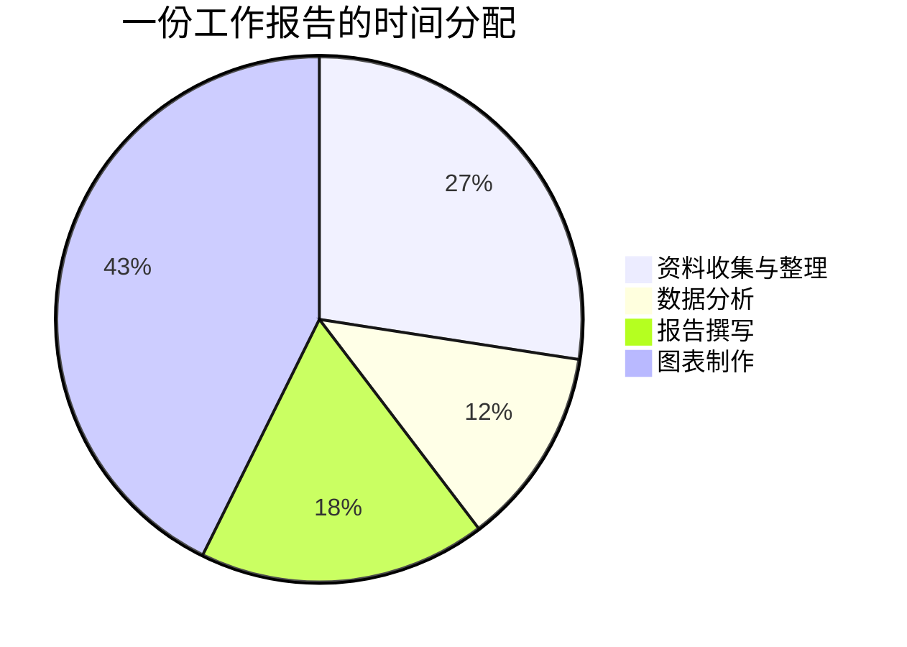
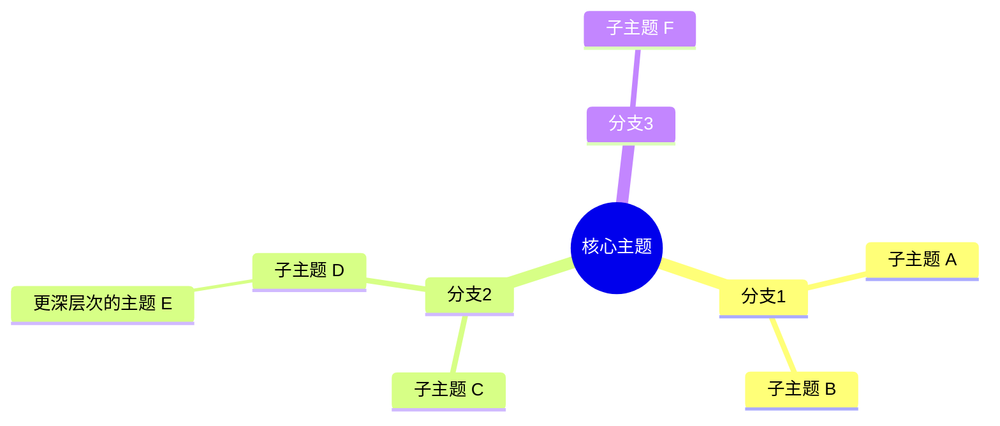
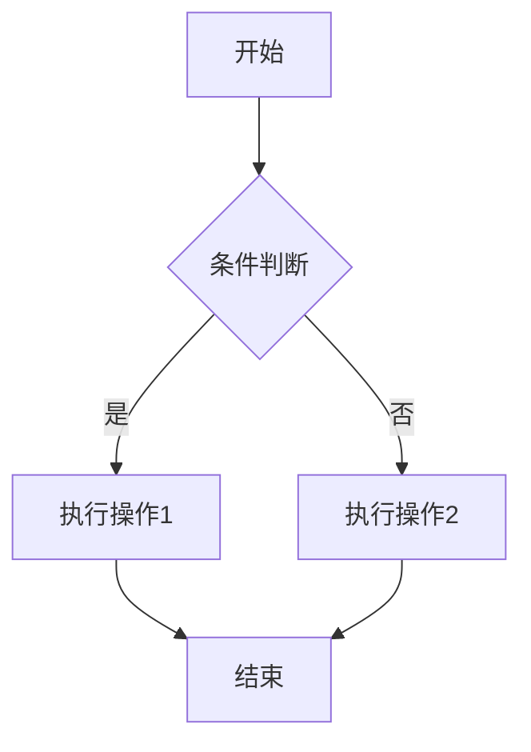
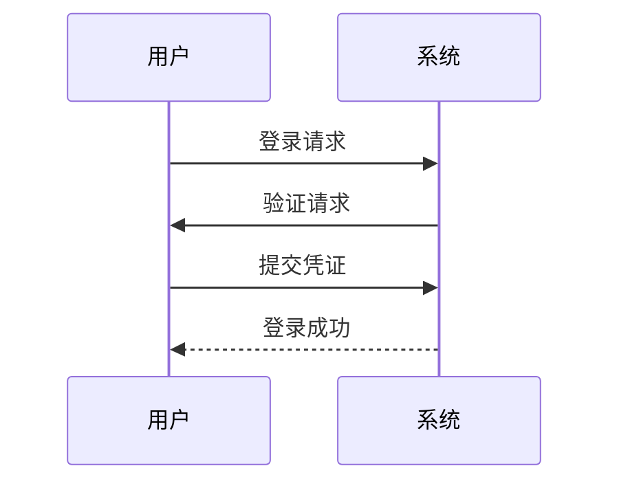
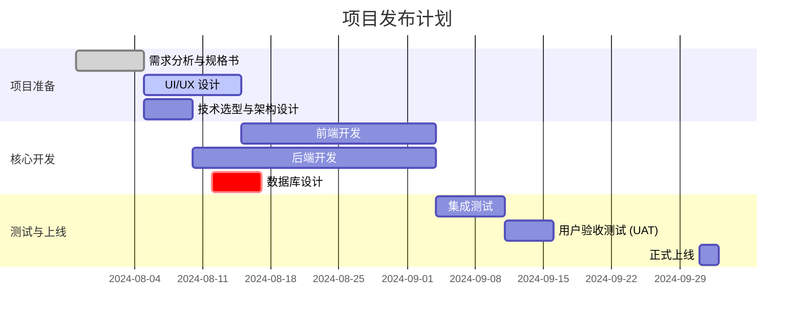
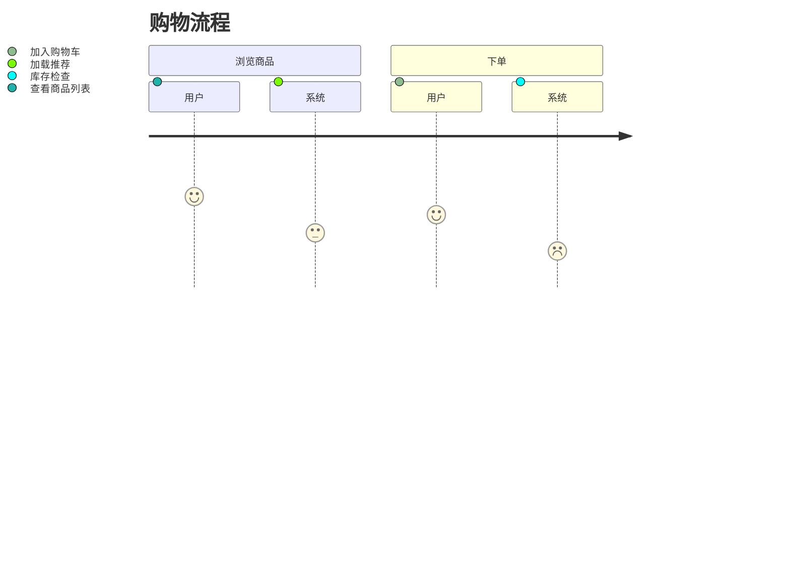
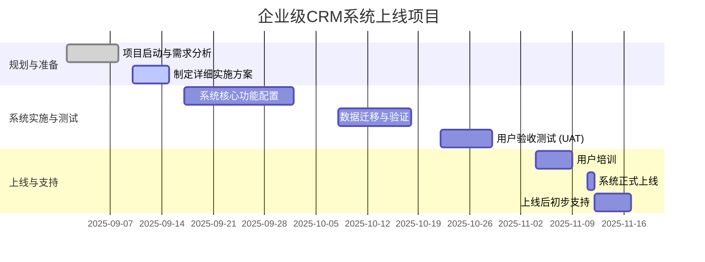

Mermaid 是一种基于 JavaScript 的图表和图表绘制工具，它使用类似 Markdown 的文本定义来动态生成图表和可视化内容。 由于其语法简单直观，用户可以轻松地将复杂的图表以文本形式嵌入到文档、网站和笔记中，便于维护和版本控制。

> **专注 AI 与个人知识管理**
> 本文属于 [杰森的效率工坊](https://jasonai.me)原创。未经允许禁止商用。
> 
> **订阅杰森的频道：**
> [YouTube](https://www.youtube.com/@JasonEfficiencyLab) · [Twitter(X)](https://x.com/JasonEffiLab) · [小红书](https://www.xiaohongshu.com/user/profile/60935957000000000101fbf7) · [B站](https://space.bilibili.com/3546884870244925)
