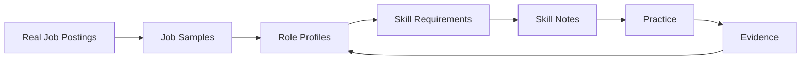

# AI 技术与职业地图

这是一个可在 Obsidian 中使用、也可直接在 GitHub 上阅读的 Job-first AI 知识库：从真实职位样本抽取 Role 和 Skill，再用 Practice/Evidence 形成可验证学习闭环。

## 从哪里开始

- [Start Here：Job-first 导航](00-Home/Start-Here.md)
- [Current State：目标 Role / 当前 Skill / 下一 Skill](00-Home/Current-State.md)
- [Job Sample Index：官方岗位样本](02-Jobs/Job-Sample-Index.md)
- [Role Map：交付物与责任簇](03-Roles/Role-Map.md)
- [Skill Index：技能、前置和练习](04-Skills/Skill-Index.md)
- [Learning Path：九步 Job-first 路径](00-Home/Learning-Path.md)
- [Evidence Index：实践证据入口](06-Evidence/Evidence-Index.md)
- [AI Technology MOC：知识参考地图](00-Home/AI-Technology-MOC.md)

## 主模型



## 目录

- `00-Home`：入口、Current State、Career/Technology MOC 和路径；
- `01-Inbox`：待验证职位、术语和雷达；
- `02-Jobs`：按时间批次的官方 Job Samples；
- `03-Roles`：Role Map、Profiles、Matrix 和 Role Skill Paths；
- `04-Skills`：可学习 Skill Notes、Index 和 Assessment；
- `05-Knowledge`：Foundations/Models/Applications/Systems/Safety 概念 taxonomy；
- `06-Evidence`：实验、项目、解释和复盘；
- `90-Sources`：市场快照与来源导航；`99-System` / `99-Templates`：规则和模板。

样本有公司、区域、职级和时间偏差，不是市场普查。打开 [Review Rules](99-System/Review-Rules.md) 了解刷新周期，提交前运行：

```bash
python scripts/check_vault.py
```
