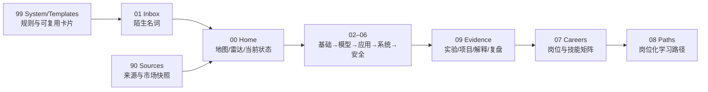

# AI 技术与职业地图

这是一个可在 Obsidian 中使用、也可直接在 GitHub 上阅读的中文知识库。它把 AI 名词、技术系统、岗位交付物和学习证据放在同一张地图上，帮助你回答：

1. 一个陌生名词属于技术栈的哪一层？
2. 一个岗位到底交付什么、需要哪些技能深度？
3. 我如何用可复现的产出证明自己已经掌握，而不是只读过资料？

## 从哪里开始

- [Start Here：首次导航](00-Home/Start-Here.md)
- [Current State：今天只维护一个当前焦点和一个下一步](00-Home/Current-State.md)
- [AI Technology MOC：七层技术地图](00-Home/AI-Technology-MOC.md)
- [Career MOC：岗位价值链](00-Home/Career-MOC.md)
- [Learning Path：Stage 0–6 学习路径](00-Home/Learning-Path.md)
- [Evidence Index：用证据替代“看完了”](09-Evidence/Evidence-Index.md)

## 结构



- `00-Home`：入口、当前状态、技术雷达、学习路径和 MOC。
- `01-Inbox`：只放尚未分类的真实术语；分类后再升级或丢弃。
- `02–06`：按七层模型组织稳定概念与当前技术，不按厂商或热度堆叠。
- `07-Careers` / `08-Paths`：岗位交付物、技能深度和岗位化学习路线。
- `09-Evidence`：实验、项目、解释和复盘；学习阶段以证据通过，而不是以阅读完成。
- `90-Sources`：带地域、样本和日期的来源索引与岗位市场快照。
- `99-System` / `99-Templates`：元数据、时效、质检规则和统一模板。

## 阅读与维护约定

Obsidian 中建议把本文件夹作为 Vault 打开，并从 [Start Here](00-Home/Start-Here.md) 进入。GitHub 上请使用本 README 的标准 Markdown 链接；Vault 内部仍可使用双向链接和关系字段。

技术基础、当前工具和岗位市场信号分开维护。`snapshot_date`、`review_after` 和来源范围用于防止旧信息被误当成当前事实；[Technology Radar](00-Home/Technology-Radar-2026-08.md) 的“Changes since last radar”记录每次更新的变化。

学习路线是“Stage 0–2 共享基础 → Stage 3 共同素养 → 按岗位分支”；Stage 4/5 只在目标岗位需要时专修。`Evidence Index` 是导航入口，实际证据必须复制模板创建独立页面，并保留问题、行动、结果、失败和判断。

这不是一份“AI 必学清单”。它是一个可删、可复查、以问题和证据驱动的个人研究系统。新增内容前先读 [Metadata Schema](99-System/Metadata-Schema.md) 和 [Review Rules](99-System/Review-Rules.md)，提交前运行：

```bash
python scripts/check_vault.py
```
